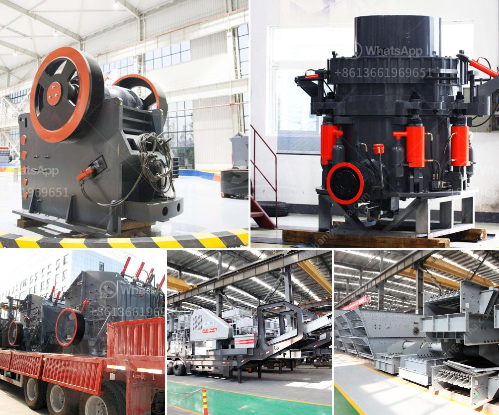

<h3>hammer mill diagram</h3>
A hammer mill is a versatile machine that is capable of grinding, shredding, and pulverizing materials into various shapes and sizes. This machinery is commonly used in various industries, especially in the grinding and milling processes. It provides a cost-effective way to process a wide variety of materials, including crops, wood waste, and biomass.

But how does a hammer mill work? To understand its working principle, we need to examine its internal structure, also known as a hammer mill diagram.

As you can see in the diagram, this versatile machine consists of several key components, including the feeding mechanism, the grinding chamber, the rotor, and the discharge mechanism.

Firstly, the raw material enters the grinding chamber through the feeding mechanism. This can be a gravity feed or a pneumatic system, depending on the mill's design and application. The feeding mechanism is equipped with a control gate or valve to regulate the flow of the material into the grinding chamber.

Once inside the grinding chamber, the material is subjected to a series of high-speed rotating hammers. The hammers are attached to the rotor, which is driven by an electric motor or a diesel engine. The rotor's rotational speed and the hammer design determine the size and shape of the particles produced during the grinding process.

As the material comes into contact with the hammers, it is shattered and pulverized into smaller fragments. This high-speed impact and pulverization process is what gives the hammer mill its name. The size of the end product can be controlled by adjusting the screen or grate located at the bottom of the grinding chamber. Different screens or grates with different hole sizes can be used to achieve the desired particle size.

Finally, the pulverized material is discharged from the grinding chamber through the discharge mechanism. This can be a gravity discharge or a pneumatic system, depending on the mill's design and application. The discharge mechanism is equipped with an adjustable gate or valve to control the flow of the finished product.

In addition to its primary grinding function, a hammer mill can also be used for other secondary processes, such as size reduction, classification, and drying. For example, in the wood pellet industry, a hammer mill can be used to crush wood chips into smaller particles and then further process them in a pellet mill to produce wood pellets.

In conclusion, a hammer mill is a versatile machine that is capable of grinding, shredding, and pulverizing materials into various shapes and sizes. Its internal structure, represented by the hammer mill diagram, plays a crucial role in the overall operation of the machine. Understanding its working principle and components can help users make informed decisions when selecting and operating a hammer mill for their specific applications.
<h3>Contact us</h3><ul><li><strong>Whatsapp:&nbsp;<a href="https://wa.me/8613661969651">+8613661969651</a></strong></li><li><a href="https://swt.shibang-china.com/?git&amp;zhl&amp;hammer mill diagram"><strong>Online Service(chat now)</strong></a></li></ul><h3>Related</h3><ul><li><a href='copper crusher price.md'>copper crusher price</a></li><li><a href='silica powder grinding machine.md'>silica powder grinding machine</a></li><li><a href='companies that sell industrial ball mills in malaysia.md'>companies that sell industrial ball mills in malaysia</a></li><li><a href='south africa mobile crusher.md'>south africa mobile crusher</a></li><li><a href='mobile crusher plant south africa.md'>mobile crusher plant south africa</a></li></ul>