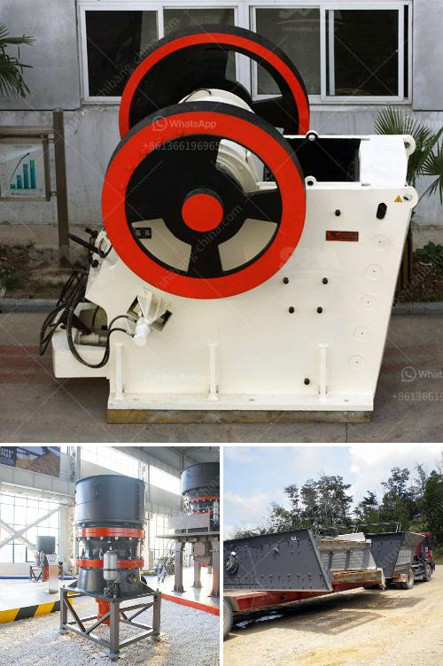

<h3>hammer mill for coal in india</h3>
Coal is a vital resource for power generation worldwide, and is also widely used in the production of metallurgical coke as well as chemical and cement industries. With the mounting environmental concerns, the importance of coal preparation is increasing in India. This has necessitated the use of equipment like hammer mills that can process coal to a consistent size and fraction.

India is the world's second-largest producer of coal, with the majority of its reserves located in the states of Jharkhand, Odisha, and Chhattisgarh. The country accounted for over 12% of the global coal consumption in 2019 and is expected to surpass China as the world's largest coal consumer by 2030, according to the International Energy Agency. With the increasing demand for coal, the efficient processing of high-quality coal has become crucial.

One of the machines that is commonly used by coal processing companies is the hammer mill. Hammer mills are robust machines that can efficiently process large quantities of coal with a particle size from 1-2 inches to 0.2 inches. Hammer mills are primarily used in the coal sector to crush coal blocks into a powder form that is then used as fuel in power plants.

The working principle of a hammer mill is simple and straightforward. Typically, horizontal or vertical rotating shafts are fitted with hammerheads. The coal blocks are fed into the mill from the top and collide with the rotating hammers. The hammers break down the coal into smaller pieces that are conveyed to the bottom of the mill for further processing.

Hammer mills are equipped with screens that allow the desired size of coal particles to pass through while retaining larger pieces for further crushing. This ensures a consistent size of coal particles for combustion, leading to more efficient power generation and reduced emissions.

The advantage of using a hammer mill is that it offers a cost-effective and efficient method of processing coal. In addition, hammer mills are flexible and can be customized to meet the unique needs of different coal processing applications. This versatility makes them highly suitable for the coal industry in India, where a wide range of coal grades and types are found.

Hammer mills also have a low maintenance cost, as they require minimal lubrication and only occasional replacement of worn-out parts. Furthermore, hammer mills have a simple design and are easy to operate, making them suitable for both large-scale coal processing plants and small-scale operations.

However, it is important to note that the efficiency and performance of a hammer mill are highly dependent on the feed rate, hammer configuration, and screen size. Therefore, it is crucial to conduct regular maintenance and optimization to ensure optimal performance.

In conclusion, hammer mills are essential equipment in the coal industry in India, as they are used for crushing and pulverizing large coal blocks into smaller particles for efficient combustion in power plants. Though there are various types of hammer mills available on the market, the versatility and cost-effectiveness of the hammer mill make it the ideal choice for coal processing. With the increasing demand for coal and the focus on environmental sustainability, the use of hammer mills for coal processing will continue to be crucial in India's energy sector.
<h3>Contact us</h3><ul><li><strong>Whatsapp:&nbsp;<a href="https://wa.me/8613661969651">+8613661969651</a></strong></li><li><a href="https://swt.shibang-china.com/?git&amp;zhl&amp;hammer mill for coal in india"><strong>Online Service(chat now)</strong></a></li></ul><h3>Related</h3><ul><li><a href='small sand grinding machine in india.md'>small sand grinding machine in india</a></li><li><a href='tonnes aggregate crusher in south africa crusher.md'>tonnes aggregate crusher in south africa crusher</a></li><li><a href='type of conveyors belt pdf.md'>type of conveyors belt pdf</a></li><li><a href='stone crusher machine spintex accra.md'>stone crusher machine spintex accra</a></li><li><a href='design of harmer mill.md'>design of harmer mill</a></li></ul>