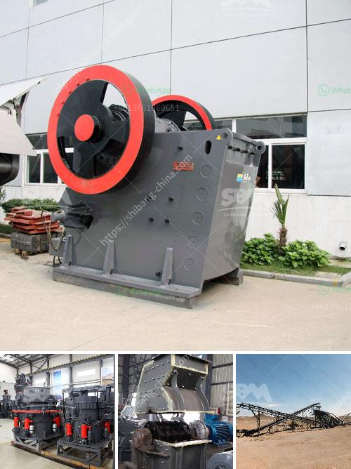

<h3>hammer mill for sale ebay</h3>
When it comes to industrial processes, grinding and crushing are some of the most fundamental operations. Hammer mills have been used for centuries to break down materials into smaller pieces, making them more manageable and easier to handle. Today, this powerful machine can be found in various industries, from agriculture to mining, thanks to its efficiency and versatility.

If you are in the market for a hammer mill, look no further than eBay. This popular online marketplace offers a wide range of options, both new and used, to suit your needs and budget. With a simple search, you can find numerous listings for hammer mills in different sizes, power capacities, and price ranges. Whether you are a small-scale farmer or a large-scale manufacturer, there is a hammer mill on eBay that can meet your requirements.

1. Cost-effective: One of the major advantages of buying a hammer mill on eBay is the potential for significant cost savings. Compared to buying directly from a manufacturer or dealer, purchasing from eBay often allows you to find used equipment at a fraction of the original price. Additionally, eBay offers various financing options, making it easier to manage the cost of your purchase.

2. Wide range of choices: eBay boasts an extensive selection of hammer mills, ensuring that you can find the perfect machine for your specific needs. Whether you need a small-scale mill for grinding feed or a larger, heavy-duty model for crushing stones, you can find it on eBay. The wide range of choices allows you to find a model that meets your desired size, power capacity, and other specifications.

3. Seller reputation and customer reviews: eBay provides a platform for sellers to build their reputation and receive feedback from customers. Before making a purchase, you can review the seller's feedback and ratings to ensure you are buying from a reputable source. This allows you to have confidence in the quality and reliability of the hammer mill you are considering.

4. Convenient and accessible: Shopping on eBay is incredibly convenient, as you can browse and make purchases from the comfort of your own home. Additionally, eBay offers various shipping options, allowing you to have the hammer mill delivered directly to your doorstep. This accessibility saves you time and effort, giving you more time to focus on your business or project.

In conclusion, purchasing a hammer mill on eBay can be a cost-effective and convenient option for many industries. With a wide range of choices, reputable sellers, and convenient shipping options, eBay provides a platform that makes finding the right hammer mill for sale easier than ever. Whether you are grinding grains, crushing rocks, or processing biomass, eBay has a hammer mill that can efficiently meet your needs. So, start exploring the listings on eBay today and find the perfect hammer mill for your business.
<h3>Contact us</h3><ul><li><strong>Whatsapp:&nbsp;<a href="https://wa.me/8613661969651">+8613661969651</a></strong></li><li><a href="https://swt.shibang-china.com/?git&amp;zhl&amp;hammer mill for sale ebay"><strong>Online Service(chat now)</strong></a></li></ul><h3>Related</h3><ul><li><a href='chinese jaw crusher.md'>chinese jaw crusher</a></li><li><a href='crusher plant design.md'>crusher plant design</a></li><li><a href='used stone crusher for sale in india.md'>used stone crusher for sale in india</a></li><li><a href='stone crusher machine in nigeria.md'>stone crusher machine in nigeria</a></li><li><a href='industrial application of pebble mill.md'>industrial application of pebble mill</a></li></ul>