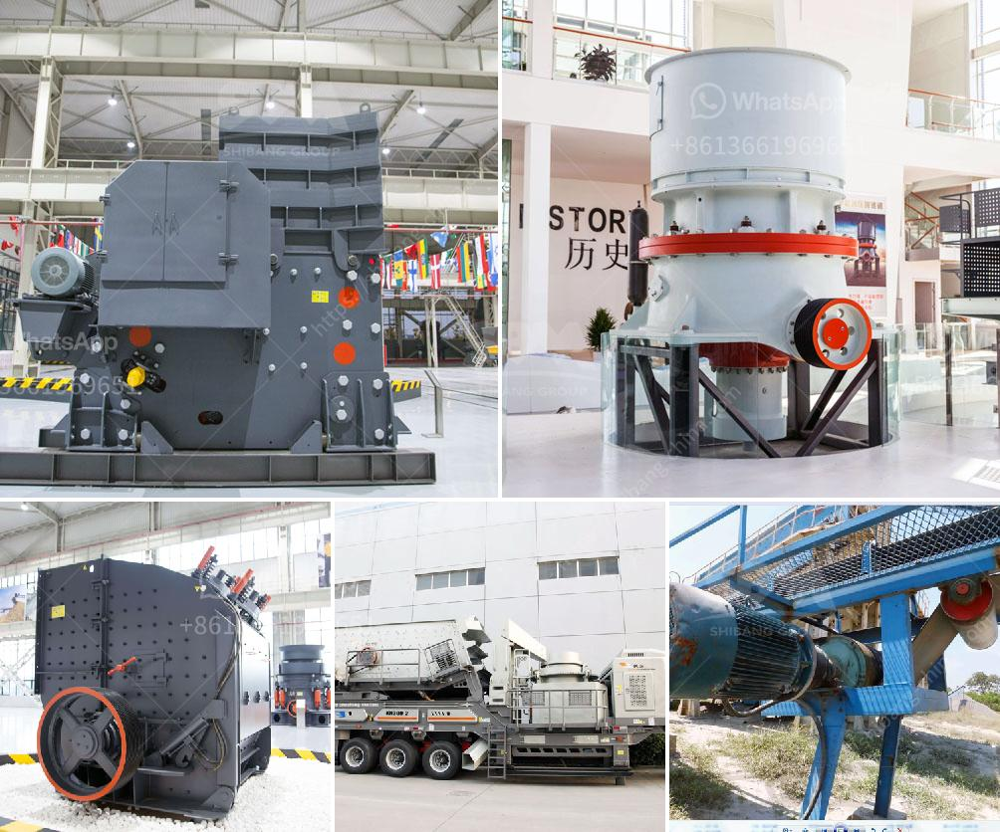

<h3>hammer mill ghana</h3>
The hammer mill machine has been developed to crush and pulverize materials such as grains, maize, cassava, yam, tubers, and other agricultural waste. Currently, Ghana produces about 1.8 million tons of waste materials annually, and majority of these wastes are agricultural in nature. This volume of waste calls for innovative solutions to effectively manage and utilize these materials.

The hammer mill in Ghana efficiently breaks down these agricultural waste materials into small pieces to facilitate further processing. The technology utilizes rotating hammers to pulverize the materials, which are then sieved through different screens to obtain desired particle sizes. This process ensures uniformity in the resulting product, making it suitable for various applications.

The versatility of the hammer mill in Ghana makes it an essential tool for the agricultural industry. Farmers can use the machine to mill grains and other crops to extract flour and other by-products for their animals. This helps to reduce feed costs and ensure a consistent supply of nutritious feed for livestock.

Additionally, the hammer mill can also be used to process various plants and waste materials to produce biofuels. By efficiently breaking down these materials, the hammer mill makes it easier to extract the essential oils, sugars, and fibers required for biofuel production. This contributes to the country's efforts in promoting renewable energy sources and reducing greenhouse gas emissions.

In conclusion, the hammer mill in Ghana plays a crucial role in the agricultural sector. Its ability to process different materials and produce desired particle sizes makes it a vital tool for farmers and entrepreneurs alike. By making use of this technology, Ghana can effectively manage its waste materials, reduce feed costs, and contribute to the development of renewable energy sources.
<h3>Contact us</h3><ul><li><strong>Whatsapp:&nbsp;<a href="https://wa.me/8613661969651">+8613661969651</a></strong></li><li><a href="https://swt.shibang-china.com/?git&amp;zhl&amp;hammer mill ghana"><strong>Online Service(chat now)</strong></a></li></ul><h3>Related</h3><ul><li><a href='limestone crusher plant.md'>limestone crusher plant</a></li><li><a href='processing of bauxite crusher.md'>processing of bauxite crusher</a></li><li><a href='iron ore mining crushing process.md'>iron ore mining crushing process</a></li><li><a href='crushers for sale.md'>crushers for sale</a></li><li><a href='small sand grinding machine in india.md'>small sand grinding machine in india</a></li></ul>