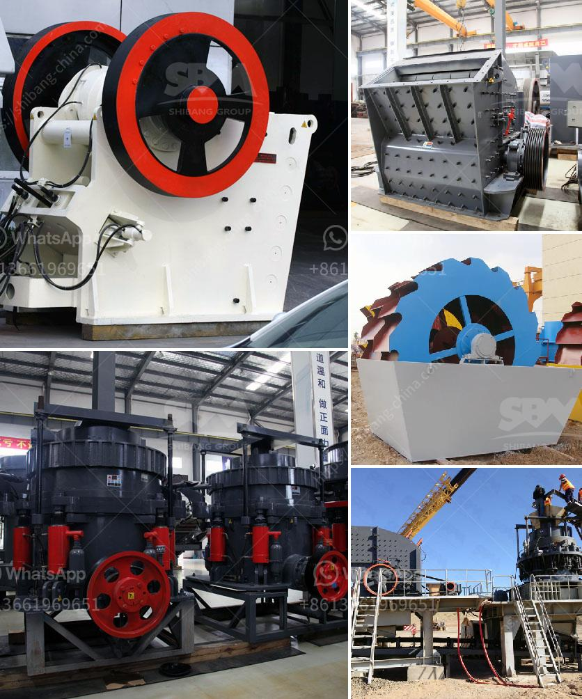

<h3>hammer mill new zealand</h3>
Hammer mill technology has made significant strides in recent years, thanks to innovative designs and advancements in manufacturing techniques. The latest hammer mills in New Zealand are designed to efficiently and effectively break down a variety of tough materials, including wood, biomass, metal scraps, glass, and even certain types of plastics.

One of the primary benefits of hammer mills is their versatility. They are highly adaptable and can be used for a wide range of applications, making them an ideal choice for various industries. For instance, in the agriculture sector, hammer mills can be used to process grains and animal feed, ensuring that the feed is of high quality and digestibility for livestock.

In the forestry and wood processing industry, hammer mills are used to grind wood chips, bark, and other forms of biomass into smaller particles. This enables these materials to be more easily processed and converted into wood pellets, which can then be used for heating and power generation. This not only makes the biomass more usable but also helps reduce waste and increase sustainability.

By incorporating cutting-edge technologies and design features, the latest hammer mills in New Zealand offer improved operational efficiency and reduced maintenance requirements. Many models now come equipped with enhanced dust and noise control systems, ensuring a safer working environment for operators. Additionally, advanced automation capabilities allow for precise control over the grinding process, resulting in consistent particle sizes and better overall product quality.

With the growing concern for the environment and efforts to reduce carbon emissions, the use of hammer mills has gained popularity in the recycling industry in New Zealand. These machines can break down metal scraps, such as aluminum cans, into smaller pieces, facilitating their subsequent processing and recycling. The same principle applies to glass and certain types of plastics, enabling their transformation into new products, thereby reducing the consumption of virgin materials.

Another advantage of hammer mills is their compact size and ease of installation. Manufacturers in New Zealand offer a range of models, including portable and stationary options, allowing businesses to choose the one that best fits their requirements. Moreover, the majority of these mills are equipped with efficient energy-saving motors, contributing to lower operational costs and reducing carbon footprint.

In conclusion, hammer mills in New Zealand have evolved significantly in recent years, offering numerous advantages in terms of versatility, efficiency, and sustainability. The ability to process a wide range of materials makes them suitable for various industries, including agriculture, forestry, recycling, and more. With continuous technological advancements and a focus on environmental consciousness, hammer mills are set to play a vital role in the country's sustainable development journey.
<h3>Contact us</h3><ul><li><strong>Whatsapp:&nbsp;<a href="https://wa.me/8613661969651">+8613661969651</a></strong></li><li><a href="https://swt.shibang-china.com/?git&amp;zhl&amp;hammer mill new zealand"><strong>Online Service(chat now)</strong></a></li></ul><h3>Related</h3><ul><li><a href='stone crushing plant leaves in uganda.md'>stone crushing plant leaves in uganda</a></li><li><a href='the process of belt conveyor.md'>the process of belt conveyor</a></li><li><a href='hydraulic cone crushers.md'>hydraulic cone crushers</a></li><li><a href='cost of setting up mini cement plant.md'>cost of setting up mini cement plant</a></li><li><a href='trommel screen suppliers in india.md'>trommel screen suppliers in india</a></li></ul>