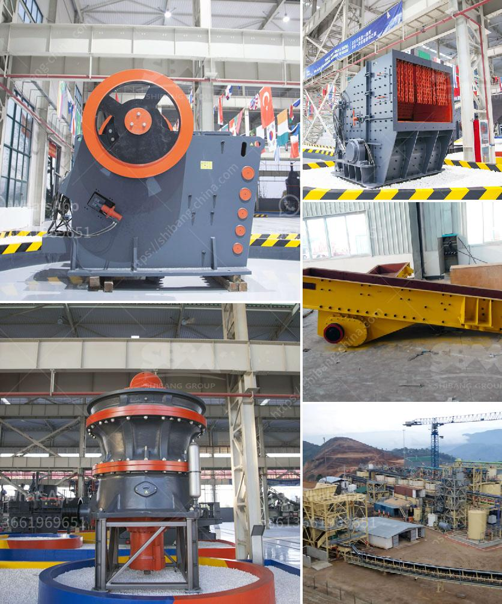

<h3>hammers mill machine</h3>
The hammer mill machine is a versatile grinding tool that is capable of processing a wide range of materials. This equipment is commonly used in the agricultural, pharmaceutical, and chemical industries. It consists of a rotor with a number of swinging hammers attached to it.

The hammer mill machine operates on the principle of impact. This means that the material is fed into the mill, and the hammers strike it, shattering it into particles of various sizes. The size of the final product can be adjusted by changing the screen size. This machine is known for its high-speed operation, allowing it to grind large quantities of material in a short period of time.

One of the key benefits of the hammer mill machine is its versatility. It can be used to grind a wide variety of materials, including grains, corn, soybeans, herbs, and spices. This makes it ideal for use in the agricultural industry, where it can be used to process feed for livestock, as well as for processing grains for human consumption.

In the pharmaceutical industry, the hammer mill machine can be used to grind and pulverize medications into fine powders. This allows for easy and precise dosing, ensuring that patients receive the correct amount of medication. It can also be used to grind other materials used in drug manufacturing, such as excipients and binders.

The hammer mill machine is also widely used in the chemical industry. It can be used to grind chemicals into a fine powder, facilitating their dissolution or blending with other substances. Additionally, this machine can be used to prepare materials for further processing, such as pelletizing or granulating.

One of the major advantages of the hammer mill machine is its simplicity. It is relatively easy to operate and maintain, requiring minimal training and expertise. This makes it an attractive option for small-scale businesses or individuals looking to process their own materials.

Furthermore, the hammer mill machine is known for its efficiency. It can grind large quantities of material in a short amount of time, saving both time and energy. This makes it a cost-effective choice for businesses looking to increase productivity while minimizing expenses.

Despite its many benefits, there are some considerations to keep in mind when using the hammer mill machine. Firstly, it is important to choose the appropriate screen size to achieve the desired particle size. Secondly, proper maintenance and regular inspections are crucial to ensure the machine operates efficiently and safely. Lastly, it is important to follow all safety precautions and wear appropriate protective equipment when operating the machine.

In conclusion, the hammer mill machine is a versatile grinding tool that is widely used in various industries. Its high-speed operation and ability to process a wide range of materials make it an invaluable piece of equipment for businesses and individuals alike. With proper maintenance and adherence to safety guidelines, the hammer mill machine can be a reliable and efficient tool for processing and grinding various materials.
<h3>Contact us</h3><ul><li><strong>Whatsapp:&nbsp;<a href="https://wa.me/8613661969651">+8613661969651</a></strong></li><li><a href="https://swt.shibang-china.com/?git&amp;zhl&amp;hammers mill machine"><strong>Online Service(chat now)</strong></a></li></ul><h3>Related</h3><ul><li><a href='sand washing plant south africa.md'>sand washing plant south africa</a></li><li><a href='vibrating sieve supplier in south africa.md'>vibrating sieve supplier in south africa</a></li><li><a href='movable gravel crusher.md'>movable gravel crusher</a></li><li><a href='chrome washing plant in limpopo for rent.md'>chrome washing plant in limpopo for rent</a></li><li><a href='mobile crusher india.md'>mobile crusher india</a></li></ul>