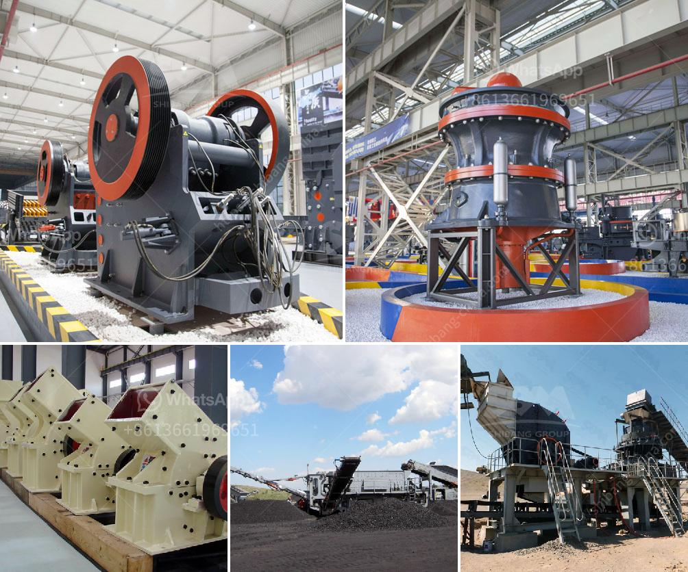

<h3>hard rock aggregates plant</h3>
The construction industry relies heavily on the availability of quality construction materials to ensure the durability and strength of every infrastructure project. Among these materials, aggregates play a vital role in providing stability and strength to concrete mixtures. One company that has been at the forefront of supplying top-notch aggregates for decades is the Hard Rock Aggregates Plant.

Located in a sprawling area of [location], the Hard Rock Aggregates Plant has been in operation since [year]. Over the years, they have gained a reputation for providing high-quality aggregates that meet industry standards and project specifications. With their unwavering commitment to quality and service, they have become one of the most trusted suppliers in the region.

One of the key reasons behind the success of the Hard Rock Aggregates Plant is their dedication to employing the latest technology in their production processes. They have invested in state-of-the-art equipment and machinery that enables them to produce aggregates of varying sizes, gradations, and characteristics. This ensures that their products can meet the specific requirements of different construction projects, whether they are residential, commercial, or infrastructure-based.

Furthermore, the plant boasts a team of highly skilled and knowledgeable professionals who oversee the entire production process. These experts have extensive experience in the industry and possess a deep understanding of the characteristics and properties of various rock formations. This expertise allows them to carefully select and process the rocks to produce aggregates that possess the necessary structural integrity and performance qualities.

In addition to their focus on quality, the Hard Rock Aggregates Plant places great importance on environmental sustainability. They adhere to strict environmental regulations and have implemented measures to minimize their carbon footprint. They have invested in energy-efficient machinery and have implemented recycling programs to reduce waste and promote the reuse of materials whenever possible. This commitment to sustainability has earned them a coveted reputation as an environmentally responsible company.

Hard Rock Aggregates is known for its wide range of aggregates, including crushed stone, gravel, sand, and rock dust. These materials are utilized in various construction applications, such as road and highway construction, building foundations, concrete production, and landscaping projects. The company's diverse product lineup ensures that contractors and builders can find the right materials for their specific needs.

Additionally, the Hard Rock Aggregates Plant has built a robust distribution network that enables them to efficiently deliver their products to customers across the region. With their own fleet of trucks and a well-organized logistics system, they can ensure timely deliveries, even for large-scale projects with demanding schedules.

Overall, the Hard Rock Aggregates Plant has established itself as a reliable and trusted source of high-quality construction materials. Their commitment to quality, technological advancements, environmental sustainability, and efficient distribution has garnered them a loyal customer base. Construction professionals can confidently rely on their aggregates to meet the stringent requirements of their projects, ensuring long-lasting and durable structures. As the demand for construction materials continues to grow, the Hard Rock Aggregates Plant remains steadfast in its mission to provide top-notch aggregates essential for the success of the construction industry.
<h3>Contact us</h3><ul><li><strong>Whatsapp:&nbsp;<a href="https://wa.me/8613661969651">+8613661969651</a></strong></li><li><a href="https://swt.shibang-china.com/?git&amp;zhl&amp;hard rock aggregates plant"><strong>Online Service(chat now)</strong></a></li></ul><h3>Related</h3><ul><li><a href='stone crusher machine spintex accra.md'>stone crusher machine spintex accra</a></li><li><a href='set up a quarry for ballast stones south africa.md'>set up a quarry for ballast stones south africa</a></li><li><a href='ballast processing machine.md'>ballast processing machine</a></li><li><a href='small scale gold mining plant in zimbabwe.md'>small scale gold mining plant in zimbabwe</a></li><li><a href='gold screening plant.md'>gold screening plant</a></li></ul>