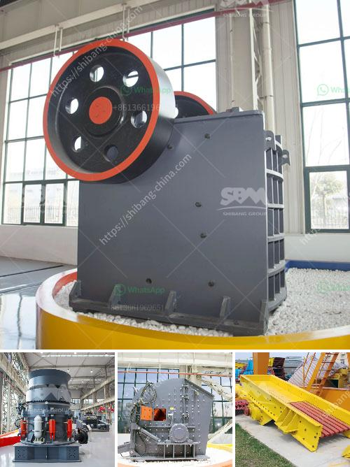

<h3>harga stone crusher kapasitas 50 ton jam</h3>
Stone crushers are machines that are utilized in construction sites and mining areas to crush stones into smaller pieces. These machines are indispensable for processing various stones into usable aggregates for construction or other purposes. One popular type of stone crusher is the harga stone crusher kapasitas 50 ton jam. This machine is able to produce high-quality stones within a short time, thus increasing overall productivity.

The harga stone crusher kapasitas 50 ton jam is an incredibly versatile machine that can be used for various purposes. It can be used to crush rocks into gravel, fine sand, or even coarse sand, depending on the desired output size. With its high production capacity, the machine is perfect for large-scale projects that require a significant amount of stone to be processed.

Another significant advantage of the harga stone crusher kapasitas 50 ton jam is its low operating costs. This machine is designed to consume less fuel, which not only reduces operational expenses but also helps protect the environment. Additionally, the machine is equipped with advanced technology that ensures efficient performance, reducing the need for frequent maintenance and repairs. This further contributes to cost savings in the long run.

When it comes to choosing a stone crusher, it is important to consider the harga stone crusher kapasitas 50 ton jam because of its numerous benefits. Not only does it produce high-quality stones quickly, but it also offers cost-effective solutions for various construction and mining projects. The versatility and low operating costs make this machine a wise investment for any business or project.

In conclusion, the harga stone crusher kapasitas 50 ton jam is a valuable machine that provides high productivity, cost savings, and environmental benefits. Its ability to crush stones into various sizes makes it suitable for a wide range of applications. Whether you need to produce gravel for construction or fine sand for landscaping, this machine can deliver excellent results. Make the smart choice and invest in a harga stone crusher kapasitas 50 ton jam for your next project.
<h3>Contact us</h3><ul><li><strong>Whatsapp:&nbsp;<a href="https://wa.me/8613661969651">+8613661969651</a></strong></li><li><a href="https://swt.shibang-china.com/?git&amp;zhl&amp;harga stone crusher kapasitas 50 ton jam"><strong>Online Service(chat now)</strong></a></li></ul><h3>Related</h3><ul><li><a href='jaw crusher plant.md'>jaw crusher plant</a></li><li><a href='drywall grinding for gypsum.md'>drywall grinding for gypsum</a></li><li><a href='grinding of limestone crusher.md'>grinding of limestone crusher</a></li><li><a href='conveyor belts china.md'>conveyor belts china</a></li><li><a href='slag crusher plant manufacturer india.md'>slag crusher plant manufacturer india</a></li></ul>