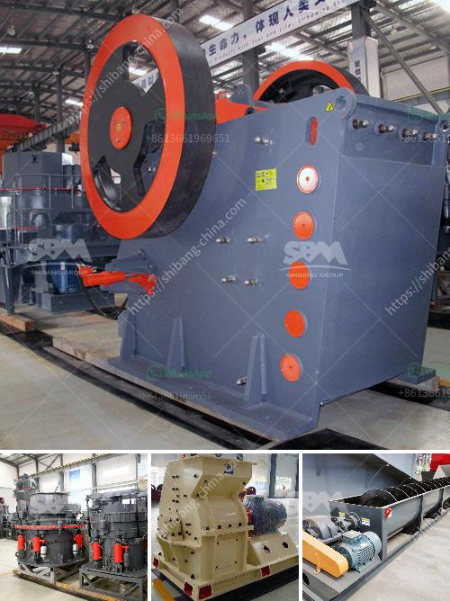

<h3>high capacity r ore raymond mill with competitive price</h3>
The mining industry is witnessing a paradigm shift with the introduction of high capacity ore Raymond mills. This state-of-the-art equipment is capable of grinding various types of minerals, making it an essential tool in the mining process. With its exceptional processing power and competitive price, this mill is revolutionizing the industry as we know it.

A key feature of the high capacity ore Raymond mill is its impressive grinding efficiency. It is equipped with advanced mechanical structures and a highly efficient impeller device. This ensures that the mill can grind minerals with exceptional precision and speed, reducing the processing time significantly. As a result, mining companies can increase their overall productivity and meet their production targets more efficiently.

Another advantage of this mill is its ability to handle a diverse range of minerals. Whether it is limestone, calcite, dolomite, marble, or any other mineral, the high capacity ore Raymond mill can handle it all. This versatility allows mining companies to process different minerals in a single unit, reducing the need for multiple mills and saving both time and resources.

What sets this mill apart from its competitors is its competitive price. Despite its exceptional performance and advanced technology, the high capacity ore Raymond mill is available at a cost-effective price point. This makes it an attractive option for mining companies looking to upgrade their equipment without breaking their budget. It provides a high return on investment, ensuring that companies can maximize their profits while improving their operations.

In conclusion, the high capacity ore Raymond mill is revolutionizing the mining industry. Its exceptional grinding efficiency, versatility, and competitive price are making it a preferred choice for mining companies worldwide. With this mill, companies can streamline their operations, increase productivity, and achieve their production goals more effectively. As the demand for minerals continues to grow, this mill will play a vital role in meeting the industry's needs.
<h3>Contact us</h3><ul><li><strong>Whatsapp:&nbsp;<a href="https://wa.me/8613661969651">+8613661969651</a></strong></li><li><a href="https://swt.shibang-china.com/?git&amp;zhl&amp;high capacity r ore raymond mill with competitive price"><strong>Online Service(chat now)</strong></a></li></ul><h3>Related</h3><ul><li><a href='river stone crushing plant crusher.md'>river stone crushing plant crusher</a></li><li><a href='how to make coal in process.md'>how to make coal in process</a></li><li><a href='price pe 600 900 stone crusher.md'>price pe 600 900 stone crusher</a></li><li><a href='sand manufacturing plant.md'>sand manufacturing plant</a></li><li><a href='stone crusher 60 to 100 tonnes per hour.md'>stone crusher 60 to 100 tonnes per hour</a></li></ul>