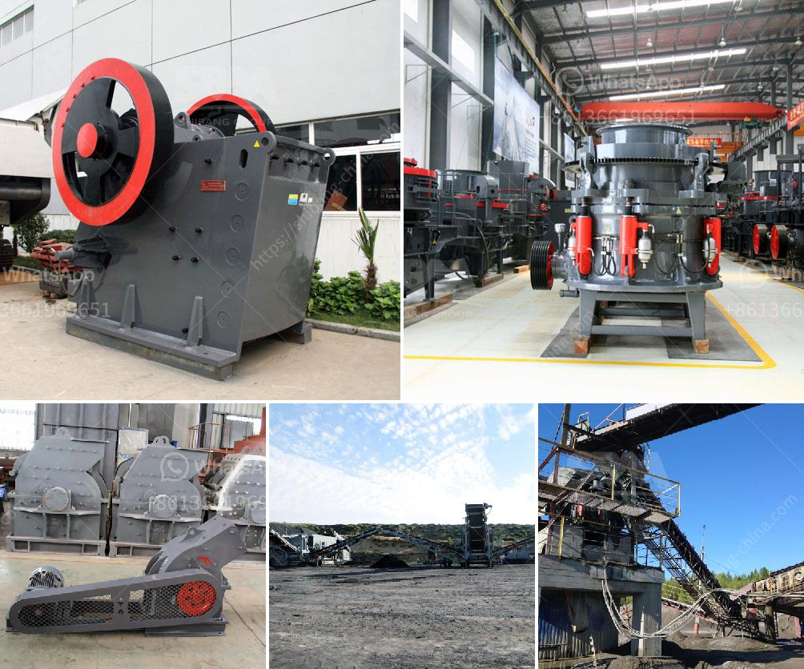

<h3>high pressure grinding mill</h3>
High pressure grinding mill, also known as HPGR, is a powerful and efficient grinding equipment designed to crush various types of hard and brittle materials. It is widely used in mining, cement, and other industries, and is an essential equipment in grinding operations.

The high pressure grinding mill uses a pair of counter-rotating rollers to press the material to be crushed between them. The material is fed into the machine from the top, and the rollers rotate at a high speed, causing the material to be squeezed and ground under the high pressure generated by the rollers. The crushed material then exits the machine through the discharge outlet.

One of the key advantages of the high pressure grinding mill is its ability to produce a fine and uniform final product. The high pressure generated by the rollers not only crushes the material, but also creates a highly compacted and stable structure. This results in a finer grind size and a more uniform particle distribution, improving the overall efficiency of the grinding process.

Another benefit of using the high pressure grinding mill is its energy efficiency. The high pressure generated by the rollers reduces the need for additional energy input, making it more energy-efficient compared to other grinding solutions. This can result in significant cost savings for the user, both in terms of energy consumption and overall operating costs.

In addition to its grinding capabilities, the high pressure grinding mill also offers other advantages. It can handle a wide range of materials, from soft to very hard, and is suitable for both dry and wet grinding applications. It is also designed to withstand high pressure and wear, ensuring long-term durability and reliability.

In conclusion, the high pressure grinding mill is a powerful and efficient grinding equipment that offers numerous benefits. Its ability to produce a fine and uniform final product, energy efficiency, and versatility make it an ideal choice for various grinding applications. Whether in mining, cement, or other industries, the high pressure grinding mill is a valuable asset that can greatly enhance grinding operations.
<h3>Contact us</h3><ul><li><strong>Whatsapp:&nbsp;<a href="https://wa.me/8613661969651">+8613661969651</a></strong></li><li><a href="https://swt.shibang-china.com/?git&amp;zhl&amp;high pressure grinding mill"><strong>Online Service(chat now)</strong></a></li></ul><h3>Related</h3><ul><li><a href='ball milling method in tamil.md'>ball milling method in tamil</a></li><li><a href='difference between jaw crusher and cone crusher.md'>difference between jaw crusher and cone crusher</a></li><li><a href='supplier of vibrating screen in philippines.md'>supplier of vibrating screen in philippines</a></li><li><a href='second hand stone crusher equipment medium size.md'>second hand stone crusher equipment medium size</a></li><li><a href='looking for hammer mill.md'>looking for hammer mill</a></li></ul>