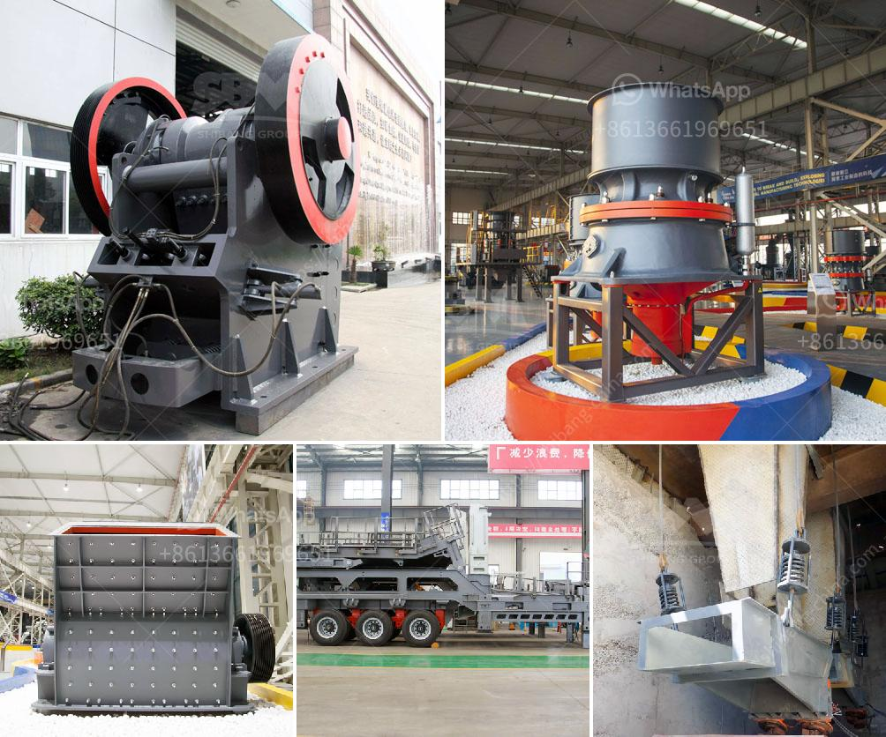

<h3>high pressure grinding roll pictures</h3>
High Pressure Grinding Roll (HPGR) is a modern and energy-efficient comminution technology that has gained popularity in recent years due to its ability to provide a significant increase in circuit capacity and energy efficiency. This technology is widely used in the mining industry and has been proven to deliver consistent results in various applications.

One of the advantages of utilizing HPGR is its ability to reduce energy consumption in the grinding process. Traditionally, crushers and tumbling mills have been used for the size reduction of ores and minerals. However, these processes are highly inefficient and result in significant energy losses. HPGR, on the other hand, operates at a much lower energy consumption level and utilizes the principle of particle-bed comminution. This process involves the compression of particles between two counter-rotating rolls, creating a high-pressure zone that causes the particles to break and disintegrate.

In order to understand the working principle of HPGR, it is essential to visualize the equipment in action. Pictures of HPGR provide a clear illustration of the equipment's design and operation. These pictures show the two rolls that are used in the process, with one roll fixed in position while the other roll is free to move. The gap between the rolls can be adjusted according to the desired product size.

The pictures also depict the feed chute, which is used to introduce the material into the crushing chamber. The material is fed evenly across the width of the rolls and is compressed and crushed as it passes through the high-pressure zone. The crushed material then exits through a discharge chute, which can be adjusted to control the product size.

Another interesting aspect captured in the pictures is the hydraulic system that is used to apply and release pressure on the rolls. This system ensures precise control of the pressure level, allowing for the optimization of the comminution process. Additionally, the pictures showcase the auxiliary systems such as lubrication and cooling, which are necessary for the reliable and efficient operation of HPGR.

In terms of application, HPGR pictures demonstrate its versatility in various industries. These include mineral processing, cement production, and diamond liberation. The pictures reveal the different configurations and sizes available, allowing for customization according to specific requirements.

In conclusion, High Pressure Grinding Roll pictures provide valuable insights into the design, working principle, and application of this modern comminution technology. These pictures allow engineers, operators, and researchers to visualize the equipment's features and understand its potential benefits in terms of energy efficiency and capacity increase. HPGR has emerged as a reliable and promising alternative to traditional grinding methods, and the pictures serve as a visual representation of this innovative technology.
<h3>Contact us</h3><ul><li><strong>Whatsapp:&nbsp;<a href="https://wa.me/8613661969651">+8613661969651</a></strong></li><li><a href="https://swt.shibang-china.com/?git&amp;zhl&amp;high pressure grinding roll pictures"><strong>Online Service(chat now)</strong></a></li></ul><h3>Related</h3><ul><li><a href='basalt curb stone crusher price.md'>basalt curb stone crusher price</a></li><li><a href='china clay manufacturing process.md'>china clay manufacturing process</a></li><li><a href='bal mill snsttlled capacity.md'>bal mill snsttlled capacity</a></li><li><a href='manganese ore mining processing process equipment.md'>manganese ore mining processing process equipment</a></li><li><a href='jaw crusher mem fr90.md'>jaw crusher mem fr90</a></li></ul>