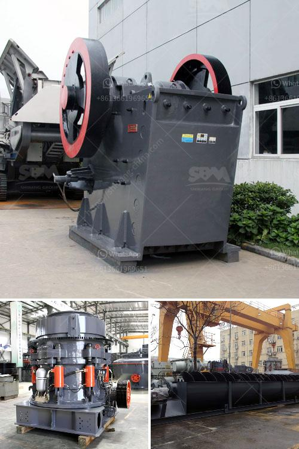

<h3>high pressure roller mill</h3>
The high-pressure roller mill, also known as the HPGR, is a widely used technology in the cement and mineral processing industry. With its low energy consumption, low maintenance requirements, and high efficiency, the high-pressure roller mill has gained increasing popularity in recent years.

The principle of operation of the high-pressure roller mill is based on the two opposite rotating rollers with the same speed and a specified gap between them. The material to be processed is fed into the gap between the rollers and is compressed and crushed by the high-pressure grinding force generated by the roller surfaces. The resulting particles are then discharged through the gap, while the oversized particles are returned to the grinding zone for further size reduction.

One of the key advantages of the high-pressure roller mill is its ability to produce a fine particle size distribution with a narrow range. This is achieved by the high-pressure grinding force that breaks down the particles into smaller sizes. This narrow particle size distribution can improve the separation efficiency in downstream processes, such as flotation or leaching.

Another advantage of the high-pressure roller mill is its low energy consumption compared to other grinding technologies. The high-pressure grinding force significantly reduces the energy required for size reduction, resulting in lower operating costs. This makes the high-pressure roller mill an attractive option for reducing the environmental impact of grinding processes.

The high-pressure roller mill also offers improved wear resistance compared to other grinding mills. The high-pressure grinding force reduces the wear of the roller surfaces, resulting in longer service life and lower maintenance requirements. This can lead to significant cost savings and increased operational efficiency.

In addition to these advantages, the high-pressure roller mill can also be used for various applications, such as cement manufacturing, mining, and ore processing. In the cement industry, the high-pressure roller mill is used for pre-grinding of raw materials before the ball mill. This can reduce the energy consumption of the ball mill and improve the production capacity.

In the mining and mineral processing industry, the high-pressure roller mill can be used to replace traditional crushers and mills, resulting in substantial energy savings and improved processing efficiency. The high-pressure roller mill is particularly suitable for crushing hard and brittle materials, such as limestone, quartz, and iron ore.

Overall, the high-pressure roller mill is a versatile and efficient grinding technology that offers several benefits in terms of energy consumption, wear resistance, and particle size distribution. As the demand for sustainable and efficient grinding technologies increases, the high-pressure roller mill is expected to play a significant role in various industries. Its ability to improve operational efficiency and reduce environmental impact makes it a valuable asset in the pursuit of sustainable development.
<h3>Contact us</h3><ul><li><strong>Whatsapp:&nbsp;<a href="https://wa.me/8613661969651">+8613661969651</a></strong></li><li><a href="https://swt.shibang-china.com/?git&amp;zhl&amp;high pressure roller mill"><strong>Online Service(chat now)</strong></a></li></ul><h3>Related</h3><ul><li><a href='cost of crusher machine in ethiopia.md'>cost of crusher machine in ethiopia</a></li><li><a href='dolomite crushing production line equipment.md'>dolomite crushing production line equipment</a></li><li><a href='cost to setup mini cement plant in india.md'>cost to setup mini cement plant in india</a></li><li><a href='japan jaw crusher price.md'>japan jaw crusher price</a></li><li><a href='mobile crusher cone france.md'>mobile crusher cone france</a></li></ul>