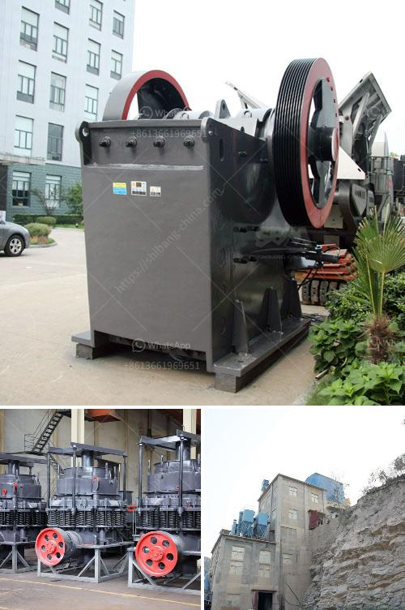

<h3>how is calcite used to manufacture paper</h3>
Calcite is a versatile mineral that finds numerous applications in various industries. One of its crucial uses is in the manufacturing of paper. By adding calcite to the paper production process, paper manufacturers can improve the quality, appearance, and performance of their products. In this article, we will explore how calcite is used in the paper manufacturing industry.

Calcite, a crystalline form of calcium carbonate, is abundant in nature and can be found in sedimentary rocks, limestone, and marble. Its chemical formula is CaCO3. Paper manufacturers utilize calcite in the form of ground calcium carbonate (GCC) or precipitated calcium carbonate (PCC) to enhance the properties of the paper.

The primary reason for using calcite in paper production is to control the paper's characteristics, such as brightness, opacity, smoothness, and ink absorption. Calcite acts as a filler, replacing some of the expensive wood fibers used in papermaking. This not only reduces the cost of production but also brings several benefits to the final product.

Calcite's exceptional properties make it an ideal filler material for paper manufacturing. It has a high brightness level, which gives the paper a crisp, clean appearance. Adding calcite to the paper pulp helps to whiten it, resulting in brighter and more attractive paper. Moreover, calcite enhances the opacity of paper, reducing its transparency and allowing for better print contrast.

In addition to improving the aesthetics of paper, calcite also enhances its functional properties. It improves the paper's smoothness, imparting a soft and silky texture. This improved smoothness facilitates better ink absorption, leading to higher quality print results and sharper images. Calcite also enhances the paper's dimensional stability, preventing it from wrinkling or curling. This makes the paper more durable and reduces the risk of tears or damage during handling.

Calcite is used in paper manufacturing in two main forms: GCC and PCC. Ground calcium carbonate (GCC) is obtained by grinding natural calcite rocks to a fine powder. It is primarily used as a filler in paper production. On the other hand, precipitated calcium carbonate (PCC) is produced through a chemical process involving calcium hydroxide and carbon dioxide. PCC particles are smaller and more uniform in size, allowing for better control over the paper's properties.

The addition of calcite, whether in the form of GCC or PCC, not only improves the physical properties of paper but also contributes to sustainability. As a natural mineral, calcite is renewable and environmentally friendly. By replacing some of the wood fibers with calcite, paper manufacturers can reduce deforestation and preserve valuable forest resources.

In conclusion, calcite plays a vital role in the paper manufacturing industry. Its use as a filler material enhances the brightness, opacity, smoothness, and ink absorption of paper. Whether in the form of GCC or PCC, calcite contributes to the overall quality and performance of the final product. Moreover, its usage promotes sustainability and reduces the environmental impact of paper production. Thanks to the versatility and abundance of calcite, the paper industry can continue to produce high-quality, visually appealing, and eco-friendly papers.
<h3>Contact us</h3><ul><li><strong>Whatsapp:&nbsp;<a href="https://wa.me/8613661969651">+8613661969651</a></strong></li><li><a href="https://swt.shibang-china.com/?git&amp;zhl&amp;how is calcite used to manufacture paper"><strong>Online Service(chat now)</strong></a></li></ul><h3>Related</h3><ul><li><a href='rock crusher for sale.md'>rock crusher for sale</a></li><li><a href='pulverized coal mill.md'>pulverized coal mill</a></li><li><a href='mobile crushers for hire in gauteng south africa.md'>mobile crushers for hire in gauteng south africa</a></li><li><a href='mobile crusher in fiji.md'>mobile crusher in fiji</a></li><li><a href='mobile crusher cone france.md'>mobile crusher cone france</a></li></ul>