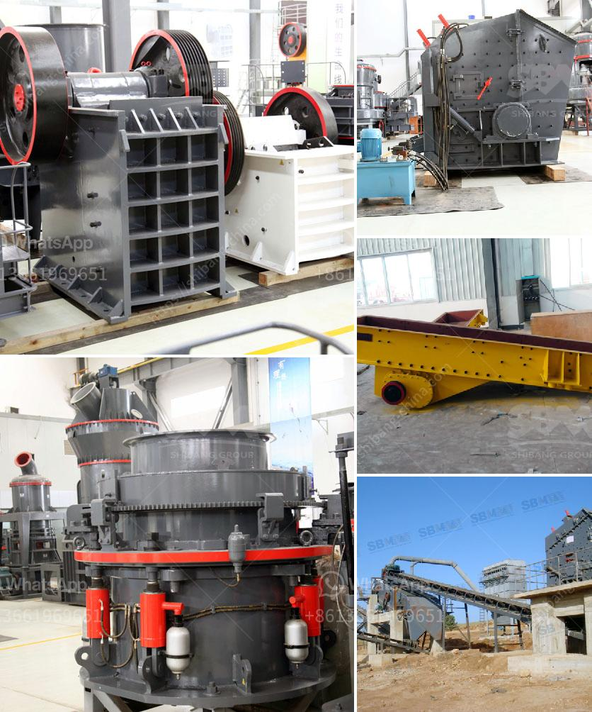

<h3>how many jaw crusher manufacturer company in india</h3>
India is home to a myriad of jaw crusher manufacturers who have carved their niche in the industry for decades. These manufacturers strive to deliver reliable, durable, and efficient jaw crushers to maximize productivity and minimize operating costs. Let's delve into the world of jaw crusher manufacturing in India.

One of the prominent jaw crusher manufacturers in India is Shree Conmix Engineers Pvt. Ltd. They offer a range of jaw crushers for various crushing needs. Their jaw crushers are engineered to exceed the primary crushing requirements of clients in the mining, quarrying, and recycling industries. Shree Conmix Engineers Pvt. Ltd. is known for its impeccable quality and commitment to customer satisfaction.

Another notable jaw crusher manufacturer in India is Propel Industries. Their jaw crushers are designed to ensure maximum productivity at minimal operating costs. Propel Industries is known for its cutting-edge technology and innovation-driven approach. They constantly strive to improve the efficiency and performance of their jaw crushers to meet the evolving requirements of the industry.

Torsa Machines Limited is another reputed jaw crusher manufacturer in India. They offer a wide range of jaw crushers that are meticulously designed to ensure high performance and reliable operation. Torsa Machines Limited is committed to delivering jaw crushers that enhance efficiency and productivity. Their crushers are suitable for primary and secondary crushing applications in various industries.

Nesans Mining and Automation Pvt. Ltd. is a renowned jaw crusher manufacturer in India. They offer an extensive range of jaw crushers that cater to various crushing needs in diverse industries. Nesans Mining and Automation Pvt. Ltd. have developed jaw crushers that ensure excellent reliability, high durability, and exceptional performance. They are known for their commitment to providing sustainable and eco-friendly crushing solutions.

Apart from these companies, there are several other jaw crusher manufacturers in India, each contributing their unique offerings to the market. These manufacturers include Amarshiva Engineering Company, Marsman India Limited, RD Group, and many more. With such a wide range of jaw crusher manufacturers, customers in India have access to a vast array of options to choose from.

The jaw crusher manufacturing industry in India is highly competitive and constantly evolving. Manufacturers strive to stay ahead of the curve by introducing innovative features and technologies in their jaw crushers. This fierce competition benefits the customers as they get access to the latest advancements and the best value for their money.

In conclusion, India is home to several jaw crusher manufacturers who endeavor to deliver top-notch crushers that meet the diverse crushing needs of various industries. These manufacturers constantly push the boundaries of technology to enhance the efficiency, reliability, and durability of their jaw crushers. With a multitude of options available, customers in India have the luxury of choosing from a wide range of jaw crushers to suit their specific requirements.
<h3>Contact us</h3><ul><li><strong>Whatsapp:&nbsp;<a href="https://wa.me/8613661969651">+8613661969651</a></strong></li><li><a href="https://swt.shibang-china.com/?git&amp;zhl&amp;how many jaw crusher manufacturer company in india"><strong>Online Service(chat now)</strong></a></li></ul><h3>Related</h3><ul><li><a href='silicon wafer crusher.md'>silicon wafer crusher</a></li><li><a href='double roller crusher manufacturer.md'>double roller crusher manufacturer</a></li><li><a href='double deck bunch crusher.md'>double deck bunch crusher</a></li><li><a href='grinding machine for salt in pakistan.md'>grinding machine for salt in pakistan</a></li><li><a href='stone quarry equipment.md'>stone quarry equipment</a></li></ul>