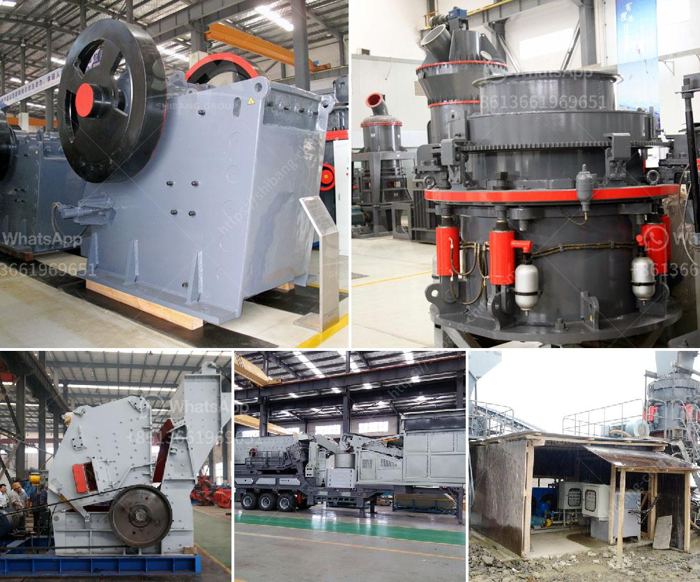

<h3>how much does gold mining licences in nigeria</h3>
Gold mining has been a synonymous endeavor with Nigeria for centuries, with the country's rich deposits of this precious metal driving both local and international interest. Nonetheless, acquiring gold mining licenses in Nigeria is not without its challenges and costs. In this article, we will explore the intricacies of gold mining licenses in Nigeria, shedding light on their costs, procedures, and the potential returns this venture holds for investors.

The Nigerian Mining Cadastre Office (NMCO) is responsible for the acquisition of mining licenses in Nigeria. Prospective gold miners must undergo a series of steps to secure the necessary licenses and permissions before commencing operations.

Before obtaining a gold mining license, exploration is typically carried out to determine the presence and quantity of gold reserves in a specific location. This requires applicants to secure an exploration license, which grants them the rights to assess the potential for commercial mining.

Once prospective miners have successfully identified viable gold deposits, they can apply for a mining lease. This license grants exclusive rights to mine, extract, and process gold within the designated area for a period of up to 25 years, renewable upon meeting stipulated conditions.

In cases where gold mining activities are limited to a smaller scale, such as artisanal and small-scale mining (ASM), individuals or cooperatives can apply for a quarry lease or small-scale mining lease, respectively.

Obtaining gold mining licenses in Nigeria comes at a cost. While the exact fees may vary depending on the scale of the operation, the following cost components are typically involved:

Prospective miners can expect to pay non-refundable application fees for each license category. These fees primarily cover the processing and administrative costs associated with evaluating and granting licenses.

Maintenance of mining licenses in Nigeria requires annual payments, also known as renewal fees. These fees are payable throughout the license tenure and are subject to change, depending on government regulations.

Beyond the license fees, additional expenses may include geological surveys, environmental impact assessments, community engagement activities, personnel salaries, equipment costs, and compliance with regulatory standards. These factors contribute to the overall budget needed to commence gold mining operations in Nigeria.

The venture of gold mining in Nigeria possesses immense potential for both local and foreign investors. The country contains significant, yet largely untapped, gold reserves estimated at over 200 million ounces. With increased governmental emphasis on developing the mining sector, opportunities for profitable gold mining ventures are prevalent.

Gold, being a versatile and globally valued commodity, presents an opportunity for substantial financial gains when properly harnessed. The market demand, coupled with Nigeria's relatively unexplored gold reserves, offers considerable returns on investment for those willing to navigate the regulatory and operational landscape.

Acquiring gold mining licenses in Nigeria serves as a gateway to a potentially lucrative venture for miners and investors alike. However, it is vital to be cognizant of the costs involved, which include application fees, annual fees, and other necessary expenses. Despite these financial implications, the potential returns on investment present a compelling opportunity for those equipped with sound industry knowledge and a commitment to ethical, sustainable mining practices. As Nigeria continues to explore strategies for unlocking its vast mineral wealth, gold mining remains an attractive and promising sector for individuals and companies seeking to participate in the nation's mining industry.
<h3>Contact us</h3><ul><li><strong>Whatsapp:&nbsp;<a href="https://wa.me/8613661969651">+8613661969651</a></strong></li><li><a href="https://swt.shibang-china.com/?git&amp;zhl&amp;how much does gold mining licences in nigeria"><strong>Online Service(chat now)</strong></a></li></ul><h3>Related</h3><ul><li><a href='philippines stone crusher.md'>philippines stone crusher</a></li><li><a href='bauxite screening machine.md'>bauxite screening machine</a></li><li><a href='clay ball mill machine.md'>clay ball mill machine</a></li><li><a href='used portable stone crusher machine for sale usa.md'>used portable stone crusher machine for sale usa</a></li><li><a href='jaw crusher quotes.md'>jaw crusher quotes</a></li></ul>