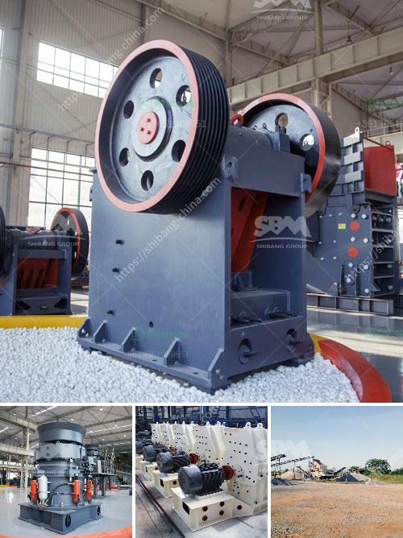

<h3>how to ball mill magnesium</h3>
Ball milling is a common method used to reduce granular particles into fine powders, suitable for various industrial applications. Magnesium, with its exceptional lightweight properties, is an excellent choice for ball milling. It is highly reactive, and easily prone to ignition when subjected to heat and sparks. Therefore, caution must be taken when milling magnesium to ensure safety and achieve optimal results. This article aims to provide a step-by-step guide on how to ball mill magnesium effectively.

When working with magnesium, it is crucial to follow strict safety measures to avoid potential hazards. Consider the following precautions:

2. Ensure proper ventilation in the working area to prevent the accumulation of potentially flammable hydrogen gas.

Selecting the appropriate ball milling equipment is essential for successful magnesium milling. A high-quality ball mill with stainless steel or ceramic balls is recommended to prevent contamination of the magnesium powder during milling.

Before milling, the magnesium should be properly prepared to enhance the milling process. This typically involves the following steps:

1. Use a hammer or mechanical methods to reduce larger magnesium pieces into smaller fragments to facilitate the milling process.

2. Ensure the magnesium is free from any oxidized layers, which can impair milling efficiency and lead to poor powder quality. If necessary, sand or wire brush the magnesium fragments to remove oxidized coatings.

Once the preparation steps are complete, proceed with milling the magnesium powder. Follow these guidelines for optimal results:

1. Load the milling jars with loosely packed stainless steel or ceramic balls, leaving enough space for the magnesium fragments to move freely during milling.

2. Fill the jar with the prepared magnesium fragments, ensuring it does not exceed 50% of the jar's volume.

4. Set the mill's rotation speed to a moderate pace, typically between 50-100 revolutions per minute (rpm).

5. Allow the mill to run for a specific duration, typically 2-4 hours, depending on the desired fineness level.

6. Periodically check the progress of the milling process to ensure the fragments are adequately pulverized.

7. Once the desired milling time has elapsed, carefully remove the milling jar from the ball mill and set it aside, allowing it to cool to avoid potential ignition hazards. 

Ball milling magnesium can be a highly rewarding process when performed safely and following the recommended guidelines. Taking necessary safety precautions and using the right milling equipment are critical to achieving successful results. By properly preparing the magnesium fragments and implementing a controlled milling process, high-quality magnesium powder can be obtained for various applications, such as pyrotechnics, aerospace, and automotive industries. Remember, safety should always remain the primary focus when handling and milling magnesium to minimize any risks associated with its reactivity.
<h3>Contact us</h3><ul><li><strong>Whatsapp:&nbsp;<a href="https://wa.me/8613661969651">+8613661969651</a></strong></li><li><a href="https://swt.shibang-china.com/?git&amp;zhl&amp;how to ball mill magnesium"><strong>Online Service(chat now)</strong></a></li></ul><h3>Related</h3><ul><li><a href='concrete crusher in kenya for sale.md'>concrete crusher in kenya for sale</a></li><li><a href='cobble stone machine nigeria.md'>cobble stone machine nigeria</a></li><li><a href='crushing machine manufacturer in pakistan.md'>crushing machine manufacturer in pakistan</a></li><li><a href='coal screening machine suppliers.md'>coal screening machine suppliers</a></li><li><a href='coal wash plant for sale in malaysia.md'>coal wash plant for sale in malaysia</a></li></ul>