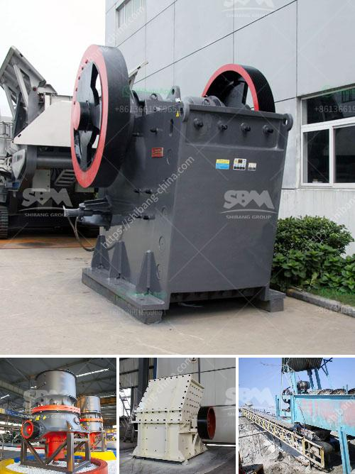

<h3>how to extract gold from river sand</h3>
Gold has been a valuable commodity for centuries, and extracting it from river sand can be an exciting and rewarding endeavor. However, the process may seem complex and intimidating for beginners. In this article, we will guide you through the steps to extract gold from river sand.

To begin extracting gold from river sand, you will need a few basic tools, such as a shovel and a classifier. You may also need a gold pan and a magnifying glass to closely examine the material you gather. Additionally, it is crucial to wear protective gear, such as gloves and safety glasses or goggles, to ensure your safety throughout the process.

Finding the right location is essential for successful gold extraction. Research local rivers and streams for areas known to have a history of gold deposits. Additionally, seek permission from landowners or acquire the necessary permits to access these areas legally.

Start by digging up a substantial amount of sand from the riverbed. It is best to choose areas with visible gold flakes, black sand, or heavy minerals, as these may indicate the presence of gold. Be careful not to collect excessive amounts of sand, as it can be laborious to process later.

Once you have gathered the river sand, use a classifier to separate the larger rocks and debris from the finer material. The classifier will help eliminate unnecessary items that could hinder your extraction process and make it easier to work with a concentrated sample.

After classifying the sand, take your gold pan and fill it with the processed material. Submerge the pan in water and gently swirl it to create a slurry, making sure not to spill any precious material. Continuously agitate the pan while keeping it under the water's surface, allowing lighter material to wash over the pan's edge. Eventually, you should be left with black sand and, hopefully, gold.

Once you have collected black sand and gold in your pan, you need to separate the gold from the other materials. Tilt the pan slightly forward, keeping a gentle stream of water over the black sand. The water flow will carry away the lighter material gradually, while the gold will remain at the bottom due to its weight. At this point, use a magnifying glass to carefully examine the remaining material for any visible gold flakes.

After successfully separating the gold, you need to purify it further. Use a small bottle, such as a vial or a clean glass jar, to hold the gold flakes. Fill the container with clean water, ensuring that the gold remains at the bottom. Rinse the gold multiple times to remove any remaining impurities. You may also choose to use chemicals specifically designed for gold purification, using caution and following the manufacturer's instructions.

Lastly, once you have obtained your gold, carefully dry it before storing it in a safe place. Some collectors keep their gold in small vials or display it in different ways to showcase their findings.

In conclusion, extracting gold from river sand can be an exciting adventure. By following the steps mentioned above and remaining patient and persistent, you will increase your chances of uncovering this precious metal. Remember to always conduct your activities legally and responsibly while respecting the environment. Happy prospecting!
<h3>Contact us</h3><ul><li><strong>Whatsapp:&nbsp;<a href="https://wa.me/8613661969651">+8613661969651</a></strong></li><li><a href="https://swt.shibang-china.com/?git&amp;zhl&amp;how to extract gold from river sand"><strong>Online Service(chat now)</strong></a></li></ul><h3>Related</h3><ul><li><a href='crusher unit price.md'>crusher unit price</a></li><li><a href='sewa mobil crusher di kaltim.md'>sewa mobil crusher di kaltim</a></li><li><a href='30 tons per hour cost.md'>30 tons per hour cost</a></li><li><a href='hydraulic cone crushers.md'>hydraulic cone crushers</a></li><li><a href='rock crushing plant for sale.md'>rock crushing plant for sale</a></li></ul>