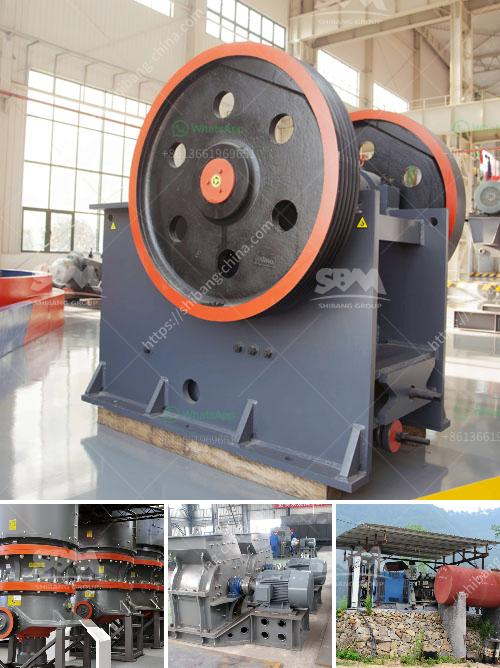

<h3>how to get aluminum from bauxite</h3>
Aluminum is one of the most widely-used metals in various industries due to its lightweight and corrosion-resistant properties. It is an essential material in the production of automobiles, airplanes, packaging materials, electrical appliances, and construction materials. Bauxite, a reddish-brown ore, is the primary source of aluminum. Today, we will explore the process of obtaining aluminum from bauxite, covering everything from extraction to refinement.

The first step in the aluminum production process involves the extraction of bauxite. This ore is found abundantly in tropical areas with high rainfall, such as Australia, Guinea, and Brazil. The process begins with the clearing of vegetation and the removal of the topsoil. Layers of bauxite are then extracted using heavy machinery like diggers and bulldozers. The extracted bauxite is transported to a processing plant for further refinement.

In the refining process, bauxite is converted into alumina through a series of chemical reactions. The primary method used is the Bayer process, named after Karl Bayer, who developed it in the late 19th century. The process involves four main steps:

1. Grinding and Digestion: The extracted bauxite is crushed into small particles, and then mixed with a hot solution of sodium hydroxide, known as caustic soda. This mixture is introduced into large pressure vessels called digesters, where it is heated to high temperatures and pressures. This step dissolves the alumina content of the bauxite while leaving behind impurities.

2. Clarification: The resulting mixture, called red mud, is then separated from the solution by settling or filtration. The solution obtained is known as aluminate liquor, which contains dissolved alumina and other impurities.

3. Precipitation: To recover the alumina from the aluminate liquor, it undergoes precipitation by adding a solution of aluminum hydroxide nuclei. This precipitation causes the alumina to solidify, forming aluminum hydroxide. The impurities in the aluminate liquor settle separately as a byproduct called red mud.

4. Calcination: The final step is the calcination of the aluminum hydroxide. It is heated to high temperatures in kilns to remove the water content, resulting in pure alumina or aluminum oxide. This alumina can then be processed further to obtain aluminum metal.

The last stage involves the smelting of alumina to produce metallic aluminum. This process takes place in large electrolytic cells called pots. The purified alumina is mixed with a molten cryolite electrolyte, which reduces the melting point of the mixture. Carbon electrodes are used to pass an electric current through the molten mixture, causing the release of aluminum ions. These ions then settle at the cathode, where they solidify and are periodically removed as aluminum metal.

In conclusion, obtaining aluminum from bauxite involves a series of steps, starting from bauxite mining to bauxite refining and aluminum smelting. The process is complex and requires specialized equipment, knowledge, and skill. However, due to the abundant reserves of bauxite worldwide, aluminum production continues to thrive, meeting the ever-increasing demand for this versatile metal.
<h3>Contact us</h3><ul><li><strong>Whatsapp:&nbsp;<a href="https://wa.me/8613661969651">+8613661969651</a></strong></li><li><a href="https://swt.shibang-china.com/?git&amp;zhl&amp;how to get aluminum from bauxite"><strong>Online Service(chat now)</strong></a></li></ul><h3>Related</h3><ul><li><a href='marbel grinding machine.md'>marbel grinding machine</a></li><li><a href='stone crusher 60 to 100 tonnes per hour.md'>stone crusher 60 to 100 tonnes per hour</a></li><li><a href='gold screening plant.md'>gold screening plant</a></li><li><a href='stone crusher kapasitas.md'>stone crusher kapasitas</a></li><li><a href='stone crusher for sale.md'>stone crusher for sale</a></li></ul>