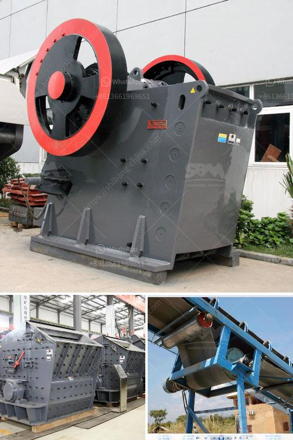

<h3>how to make coal in process</h3>
Coal is a versatile and widely-used fossil fuel that has been a significant energy source for centuries. It is primarily formed from the remains of ancient plants and trees that underwent geological processes over millions of years. For those interested in understanding the process of making coal, this article will provide a step-by-step guide on how to create coal.

Coal formation requires a source of organic material, mainly ancient plants and trees. The plant material should ideally be high in carbon, such as woody debris or peat moss, to produce high-quality coal. Locate an area rich in these organic materials, such as swamps, peat bogs, or forests.

Over time, the selected organic material decomposes and accumulates in oxygen-poor environments. This process, known as peatification, is crucial for further coal formation. Peat, the initial stage of coal, consists of partially decayed organic matter and can often be found in waterlogged areas.

To create coal from peat, it must undergo geological processes, including heat and pressure, over millions of years. This transformation takes place deep underground in sedimentary basins. The accumulation of sediments above the peat compresses it, reducing its water content and increasing its carbon concentration.

Following substantial heat and pressure, the peat morphs into the first stage of coal known as lignite or brown coal. Lignite has a high moisture content compared to other coal types. It is usually brownish in color and relatively low in carbon content. This process may take several hundred thousand years.

As the geological processes continue, lignite transforms into sub-bituminous coal. This type of coal has a lower moisture content and higher carbon content than lignite. After additional heat and pressure over millions of years, sub-bituminous coal eventually progresses into bituminous coal, which is characterized by its relatively high carbon content.

The final stage of coal formation requires extreme heat and pressure. Bituminous coal progressively matures into anthracite, which is the highest rank of coal. Anthracite is hard, black, and has the highest carbon content and lowest moisture content among all coal types. Its formation generally takes around 300 million years.

While the process of coal formation requires millions of years and geological forces beyond human control, understanding the steps involved provides insight into its origins. Appreciating the lengthy and intricate process helps us comprehend the immense value that coal offers as a reliable source of energy. It is essential to recognize that the process described in this article pertains to the natural occurrence of coal and cannot be replicated artificially within a short span of time.
<h3>Contact us</h3><ul><li><strong>Whatsapp:&nbsp;<a href="https://wa.me/8613661969651">+8613661969651</a></strong></li><li><a href="https://swt.shibang-china.com/?git&amp;zhl&amp;how to make coal in process"><strong>Online Service(chat now)</strong></a></li></ul><h3>Related</h3><ul><li><a href='floatation equipment iron ore beneficiation germany.md'>floatation equipment iron ore beneficiation germany</a></li><li><a href='crusher manufacturer in pune ie.md'>crusher manufacturer in pune ie</a></li><li><a href='crusher plants in pakistan.md'>crusher plants in pakistan</a></li><li><a href='jaw crusher each equipment.md'>jaw crusher each equipment</a></li><li><a href='used marble machinery turkey.md'>used marble machinery turkey</a></li></ul>