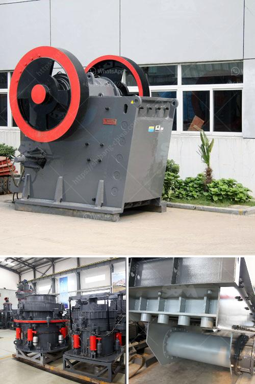

<h3>how to make powder red clay for glazes</h3>
Red clay is a versatile material that has been used for thousands of years in pottery and ceramics. Its warm hue and natural appeal make it a popular choice for glazes on pottery and other artistic creations. Making your own powdered red clay for glazes allows you to have full control over the quality and consistency of the material. In this article, we will guide you through the process of making powder red clay for glazes.

The first step is to acquire high-quality red clay. Red clay is commonly found in areas with iron-rich soil. Look for clay deposits near riverbanks, hillsides, or construction sites. You can also purchase red clay from ceramics suppliers or local pottery studios. Ensure that the clay is free of impurities and contaminants.

Once you have found a suitable source of red clay, you will need to dig it out. Use a shovel or trowel to carefully remove the top layer of soil and expose the clay beneath. Dig down until you reach a depth where the clay is consistent in color and texture.

Spread the clay on a large, flat surface such as a tarp or concrete floor to dry it. Allow the clay to dry completely, which may take several days or even weeks, depending on the weather conditions. Once the clay is dry, use a hammer or mallet to break it into smaller chunks. Ensure that all clumps are broken down into fine pieces.

To turn the dried clay into a fine powder, you will need to grind it further. There are several methods you can use:

- Mortar and Pestle: This traditional method involves manually grinding the clay using a mortar and pestle. It may take some time and effort, but it can yield excellent results.

- Food Processor: A food processor with a sharp blade can also be used to grind the dried clay into a powder. Break the clay into smaller pieces and place them into the food processor. Pulse it until the clay reaches the desired consistency.

- Ball Mill: If you have access to a ball mill, it can be a very efficient and quick way to grind the red clay into powder. Simply place the clay inside the mill, and let it tumble with heavy balls or rocks. This grinding process creates a fine powder.

After grinding, you may find there are still some larger particles or impurities in the clay powder. To remove these, pass the powder through a fine-mesh sieve or screen. This will ensure a smooth and consistent material for your glazes.

Finally, store the powdered red clay in a clean, airtight container to maintain its quality. Keep it in a cool, dry place away from moisture and direct sunlight to prevent any deterioration.

By following these steps, you can create your own powdered red clay for glazes. Experiment with different proportions of clay to other glaze materials to achieve the desired color and texture in your pottery creations. Making your own clay powder allows you to personalize your glazes and enjoy the unique qualities of red clay in your artistic pursuits.
<h3>Contact us</h3><ul><li><strong>Whatsapp:&nbsp;<a href="https://wa.me/8613661969651">+8613661969651</a></strong></li><li><a href="https://swt.shibang-china.com/?git&amp;zhl&amp;how to make powder red clay for glazes"><strong>Online Service(chat now)</strong></a></li></ul><h3>Related</h3><ul><li><a href='roller mill in china.md'>roller mill in china</a></li><li><a href='tertiary stone crusher.md'>tertiary stone crusher</a></li><li><a href='ore crusher copper ore crusher.md'>ore crusher copper ore crusher</a></li><li><a href='smallest mobile jaw crusher for sale south africa.md'>smallest mobile jaw crusher for sale south africa</a></li><li><a href='silica sand import in europe.md'>silica sand import in europe</a></li></ul>