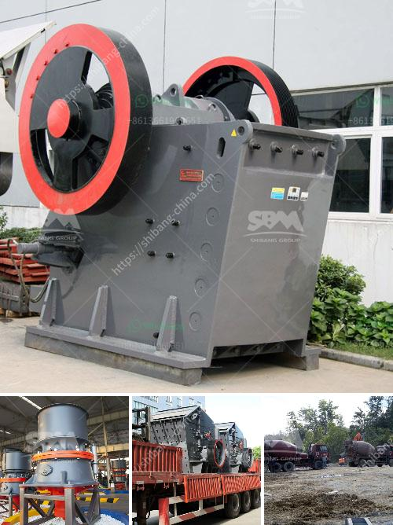

<h3>how to make stone crusher plant</h3>
Stone Crushing industry plays a crucial role in the economy sector of every country. However, the stone crushing plant in today's scenario is considered as an inevitable part due to its indispensable usage. Major construction projects require excavation and crushing of large stones to build roadways, bridges, buildings, and other infrastructural projects. The market for stone crushers is booming as these crushers can be easily set up and operated on a one-time investment.

The stone crusher plant is an efficient and high-quality crusher machine. But how to make the stone crusher plant design more reasonable and efficient? First, the mining project will need a plan that meets the environmental regulations and operational standards. Second, important consideration is the crusher machine technology and output characteristics, which will affect the investment cost.

In the stone crushing plant, the equipment used in the crusher machine is a vibrating feeder, jaw crusher, impact crusher, vibrating screen, belt conveyor. The crushing process mainly divided into three stages, namely primary crushing, secondary crushing, and fine crushing. To break the stone into desired size, these machines will need a large number of parts, such as blow bars, jaw plates, hammers, impact plates. Also, the accessories such as vibrating feeder's vibrating screen, conveyors, and so on all need to be selected in a proper way to ensure consistent and efficient production.

When designing a stone crusher plant, there are many factors to consider, such as the availability of raw materials, the market demand for stones, and the required output of the finished products. The crushing equipment commonly used in the stone crushing plant includes a jaw crusher, impact crusher, cone crusher, vertical shaft impact crusher, etc. It is used to crush medium hardness and extremely hard materials. And it is widely used in the metallurgical industry, building materials industry, road construction industry, chemical industry, and other industries.

To design an optimal stone crushing plant, it requires sufficient planning and the workforce. For larger projects, professional consultation from relevant experts can also be sought. A well-designed and properly executed crushing plant can effectively increase productivity and improve final product quality. In addition, it can also make the stone crusher plant more economical and environmentally friendly.

Furthermore, the location, layout, and design of the stone crusher plant are also important factors to consider. For instance, buildings, roads, and other infrastructures will come up around the stone crusher plant, ensuring the smooth operation and normal production of the plant. The overall project design will also depend on the following factors:

1. The type of stone: Different types of stones have different hardness and characteristics. It is crucial to choose the right type of stone crusher machine that can withstand abrasion and high impact.

2. Production capacity requirements: The desired production capacity should be considered to select the appropriate equipment. It can range from a few tons per hour to several hundred tons per hour.

3. Material size requirements: The size and shape of the raw material will also affect the choice of equipment and the final product. The type of machine selected should be able to reduce the size of the material to the desired range.

4. Environmental considerations: The stone crusher plant should comply with the environmental regulations and follow good practices to minimize dust emissions, noise, and other pollutants. The use of effective dust suppression systems and the proper management of waste materials are crucial for the project's sustainability.

In conclusion, the stone crusher plant is a valuable asset for the construction industry. The success of any construction project depends on its smooth operation and adoption of sustainable practices. Therefore, it is essential to invest in a well-designed and properly executed stone crusher plant that meets the production requirements, adheres to environmental regulations, and delivers high-quality products.
<h3>Contact us</h3><ul><li><strong>Whatsapp:&nbsp;<a href="https://wa.me/8613661969651">+8613661969651</a></strong></li><li><a href="https://swt.shibang-china.com/?git&amp;zhl&amp;how to make stone crusher plant"><strong>Online Service(chat now)</strong></a></li></ul><h3>Related</h3><ul><li><a href='sale limestone crusher malaysia.md'>sale limestone crusher malaysia</a></li><li><a href='sand washinng plant makers in srilanka.md'>sand washinng plant makers in srilanka</a></li><li><a href='used industrial dryer for sale in india.md'>used industrial dryer for sale in india</a></li><li><a href='hammer mill capacity 80 ton per hour.md'>hammer mill capacity 80 ton per hour</a></li><li><a href='production process of calcium carbonate.md'>production process of calcium carbonate</a></li></ul>