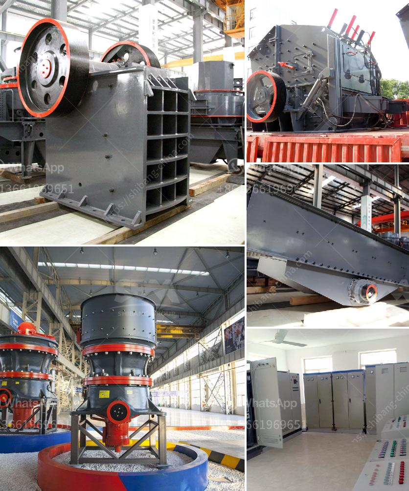

<h3>how to use hammer mill</h3>
Hammer mills are machines used to shred or crush materials into smaller pieces. Their primary purpose is to reduce the size of materials so that they can be used for various purposes such as animal feed, mulch, biomass, and more. In this article, we will discuss how to effectively use a hammer mill.

The first step in using a hammer mill is to ensure that the machine is suitable for your specific application. Some hammer mills are designed for crushing large quantities of bulk materials while others are best suited for grinding or pulverizing materials into fine particles. Choose a hammer mill that fits your materials and production volume requirements.

Before feeding your materials into the hammer mill, make sure they are properly prepared. This may involve reducing large pieces of material into smaller, more manageable sizes. For example, if you are using wood chips, you may need to shred them using a wood chipper or similar equipment, ensuring that they are easily processed by the hammer mill.

Hammer mills have adjustable settings that allow you to control the size of the output particles. Depending on your specific needs, you may want to adjust the settings to achieve the desired particle size. Keep in mind that the finer the particle size, the longer it may take to process the materials.

Once your materials are prepared and the settings are adjusted, it's time to start the hammer mill. Ensure that all safety precautions are followed, such as wearing protective gear like goggles and gloves. Check that all components are properly secured and that the machine is in good working condition before turning it on.

Carefully and slowly feed the materials into the hopper of the hammer mill. It's important to avoid overloading the machine, as this can lead to inefficient processing or damage to the equipment. Monitor the feeding rate and adjust accordingly to maintain a consistent flow of materials.

As the materials are being processed, keep an eye on the output. The size and consistency of the final product should be within your desired specifications. If necessary, make additional adjustments to the hammer mill settings to achieve the desired outcome.

Regular maintenance and cleaning are essential for optimal performance and longevity of the hammer mill. Follow the manufacturer's guidelines for maintenance, such as lubricating moving parts and checking for any signs of wear or damage. Clean the machine regularly to remove any buildup or debris that can affect its efficiency.

In conclusion, hammer mills are versatile machines that can be used for various applications. By selecting the right hammer mill, preparing your materials, adjusting the settings, and properly maintaining the machine, you can ensure efficient and effective processing of your materials. Remember to always prioritize safety and follow the manufacturer's guidelines to get the most out of your hammer mill.
<h3>Contact us</h3><ul><li><strong>Whatsapp:&nbsp;<a href="https://wa.me/8613661969651">+8613661969651</a></strong></li><li><a href="https://swt.shibang-china.com/?git&amp;zhl&amp;how to use hammer mill"><strong>Online Service(chat now)</strong></a></li></ul><h3>Related</h3><ul><li><a href='cement export price in ethiopia.md'>cement export price in ethiopia</a></li><li><a href='processing of bauxite crusher.md'>processing of bauxite crusher</a></li><li><a href='small rock crushers for recreation.md'>small rock crushers for recreation</a></li><li><a href='vibrating sieve supplier in south africa.md'>vibrating sieve supplier in south africa</a></li><li><a href='schenck weighbelt feeders calibration procedure.md'>schenck weighbelt feeders calibration procedure</a></li></ul>