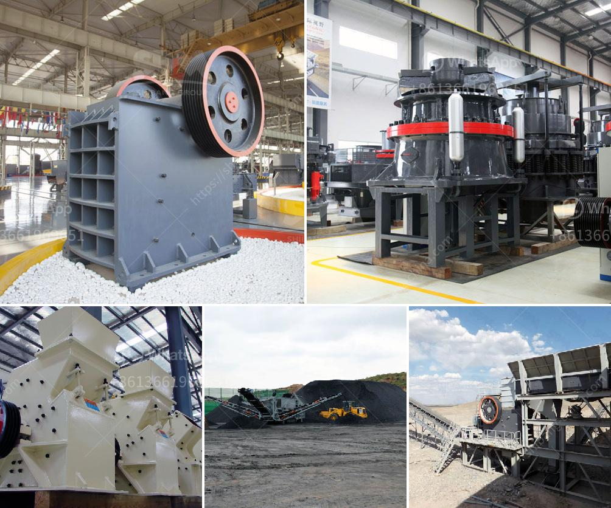

<h3>hydraulic concrete crusher rent mn</h3>
When it comes to demolishing large structures, such as buildings or bridges, traditional methods can be time-consuming and labor-intensive. However, with the advancement in technology, hydraulic concrete crushers have emerged as a cost-effective solution for demolition projects. These high-powered machines provide incredible crushing force, making quick work of even the toughest concrete structures. In Minnesota (MN), these hydraulic concrete crushers are readily available for rent, allowing contractors to efficiently complete their demolition projects.

One of the key advantages of hydraulic concrete crushers is their ability to break down concrete into smaller, more manageable pieces. Traditional methods often involve the use of heavy machinery, such as wrecking balls and jackhammers, which can cause damage to the surrounding environment. Additionally, these methods require extensive labor and time to remove the debris manually. On the other hand, hydraulic concrete crushers rely on powerful jaws and hydraulic pressure to crush concrete with ease. This results in smaller debris that is easier to handle and transport.

Another significant benefit of hydraulic concrete crushers is their versatility. These machines can handle various types of concrete structures, including reinforced concrete. They can crush concrete walls, slabs, columns, and foundations, among others. Furthermore, hydraulic crushers offer adjustable jaw settings, allowing contractors to control the output size of the crushed material. This flexibility is particularly useful when different sizes of crushed concrete are required for various purposes, such as recycling or fill material.

By opting to rent hydraulic concrete crushers, contractors can save on equipment costs. Purchasing such equipment may not be financially viable for all demolition projects, especially for smaller or one-time jobs. Renting allows contractors to utilize state-of-the-art machinery without the burden of ownership and maintenance costs. Additionally, rental services often provide trained operators to operate the crusher safely and effectively, minimizing the risk of accidents or damages.

Renting hydraulic concrete crushers in MN also promotes environmental sustainability. Crushing concrete on-site significantly reduces the need for transportation to disposal sites, minimizing carbon emissions and traffic congestion. Furthermore, crushed concrete can be recycled and used for various purposes, such as road base, backfill, or new construction projects. By embracing eco-friendly practices, contractors can contribute to the reduction of waste sent to landfills and promote a greener construction industry.

Before renting a hydraulic concrete crusher, contractors should consider certain factors. The capacity and size of the machine should align with the specific project requirements. The rental agreement should also outline any additional services provided, such as transportation or operator training. It is important to thoroughly review the rental terms and conditions, including insurance coverage and liability responsibilities.

In conclusion, hydraulic concrete crusher rentals in MN offer numerous advantages for demolition projects. These machines provide a cost-effective and efficient solution for crushing concrete structures, ultimately reducing labor and time. With their versatility and adjustable settings, hydraulic crushers cater to various demolition needs. Renting hydraulic concrete crushers also promotes environmental sustainability and reduces equipment costs for contractors. With these state-of-the-art machines readily available, contractors can confidently tackle their demolition projects in Minnesota.
<h3>Contact us</h3><ul><li><strong>Whatsapp:&nbsp;<a href="https://wa.me/8613661969651">+8613661969651</a></strong></li><li><a href="https://swt.shibang-china.com/?git&amp;zhl&amp;hydraulic concrete crusher rent mn"><strong>Online Service(chat now)</strong></a></li></ul><h3>Related</h3><ul><li><a href='how to get aluminum from bauxite.md'>how to get aluminum from bauxite</a></li><li><a href='vibrating feeder screen.md'>vibrating feeder screen</a></li><li><a href='how to make stone crusher plant.md'>how to make stone crusher plant</a></li><li><a href='dolomite crushing production line equipment.md'>dolomite crushing production line equipment</a></li><li><a href='cement crusher in turkey.md'>cement crusher in turkey</a></li></ul>