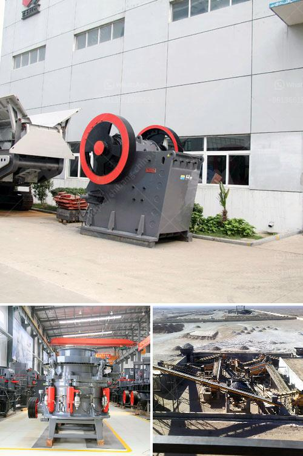

<h3>hydraulic cone crushers</h3>
Hydraulic cone crushers are widely used in the mining industry for crushing various materials such as iron ore, non-ferrous metal ore, granite, limestone, quartzite, sandstone, and pebbles. They are ideal for secondary and tertiary crushing stages and efficiently reduce the size of materials for further processing.

One of the most significant advantages of hydraulic cone crushers is the automatic adjustment of the discharge opening. This feature allows for consistent product size and ensures that the crusher can operate at its full capacity, delivering high-quality output. The hydraulic system also helps in preventing iron overload, which can cause damage to the crusher components. Additionally, the hydraulic system eliminates the need for manual adjustment, saving time and effort during maintenance.

The design of hydraulic cone crushers incorporates the latest technology in crushing principles and equipment configurations. These crushers are equipped with hydraulic systems that enable a smooth and safe operation. The unique design also allows for easy maintenance and accessibility to all service points, promoting quick and efficient servicing whenever needed.

Another important feature of hydraulic cone crushers is their high-performance capability. These crushers are designed to handle large amounts of material and provide superior crushing efficiency. Their strong crushing force and high production capacity ensure that even the toughest materials can be crushed effectively. This makes hydraulic cone crushers ideal for applications with demanding requirements, such as mining and quarrying operations.

Hydraulic cone crushers also excel in terms of versatility. With a wide range of applications, these crushers can be used in various industries including aggregates, recycling, and mineral processing. Their ability to handle different types of materials makes them suitable for a variety of crushing tasks. Whether it's crushing hard rocks or processing soft materials, hydraulic cone crushers can deliver reliable performance.

Furthermore, hydraulic cone crushers offer excellent particle shape control. The combination of crushing chamber configuration and the use of laminated crushing principle results in a uniform and consistent product shape. This helps to reduce the amount of fines and ensures that the final product meets the required specifications. It also improves the overall quality of the end product, making it suitable for various applications.

In conclusion, hydraulic cone crushers are reliable and efficient crushers that provide exceptional performance in various crushing applications. Their automatic adjustment, high-production capacity, versatility, and particle shape control make them a preferred choice for many mining and quarrying operations. With the advanced technology and design incorporated in these crushers, they are well-equipped to meet the challenges of modern crushing requirements. Whether it's primary, secondary, or tertiary crushing, hydraulic cone crushers can effectively handle a wide range of materials and deliver consistent and high-quality output.
<h3>Contact us</h3><ul><li><strong>Whatsapp:&nbsp;<a href="https://wa.me/8613661969651">+8613661969651</a></strong></li><li><a href="https://swt.shibang-china.com/?git&amp;zhl&amp;hydraulic cone crushers"><strong>Online Service(chat now)</strong></a></li></ul><h3>Related</h3><ul><li><a href='aggregate crusher plants machinery.md'>aggregate crusher plants machinery</a></li><li><a href='ball mill hammer.md'>ball mill hammer</a></li><li><a href='mobile aggregate crusher.md'>mobile aggregate crusher</a></li><li><a href='nigeria hammer mill.md'>nigeria hammer mill</a></li><li><a href='large scale mining vs small scale mining.md'>large scale mining vs small scale mining</a></li></ul>