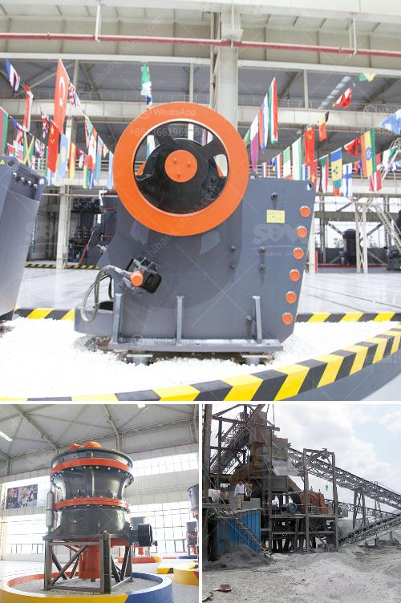

<h3>i need for a stone crushing plant</h3>
There are a large variety of machines that are available in a stone crushing plant. This equipment is used for extracting stones, rocks, boulders, and gravel from the earth to be utilized for various purposes. These machines are utilized in mining, metallurgy, building, road construction, and many other industries. Ensuring the supply of high-quality aggregate is essential for construction projects, thus requiring the need for a stone crushing plant.

A stone crushing plant requires a machine for constant loading and unloading on the zone. The rocks need to be crushed into a manageable size for the crushers. The size of the rocks determines the crusher type and jaw crushers have a fixed jaw and a mobile jaw. The rocks are dropped between the jaws and crushed into stones of desired size.

The plant takes huge rocks or boulders from the mines, and further turns them into aggregates that can be used in road construction projects, building materials, and creating cement. The crusher breaks down the larger rocks to a size suitable for transport on the conveyor belt. Once the stones are crushed, they are then stored in a range of different storage areas for further usage.

Having a stone crushing plant is essential in the mining industry. There are several stages involved in the process of making aggregates. First, the rocks are collected from mines and quarries and are further crushed to reduce them in size. The material is then screened to separate the stones according to their size. Finally, the crushed and screened material is mixed to make a concretionary mixture, commonly known as aggregate.

The aggregate produced through a stone crushing plant is appropriately suitable for applications that include road construction, manufacturing plaster, ready-mix concrete, and asphalt. The aggregates produced through a stone crushing plant become a premium product within the market and are used in various infrastructural projects.

One major factor that plays a crucial role in the overall success of a stone crushing plant is the availability of raw materials. The availability of different types of raw materials makes the production process run smoothly and efficiently. Additionally, the plant needs an adequate supply of labor and machinery to handle the entire process effectively.

Furthermore, a stone crushing plant requires continuous supervision to ensure that it is consistently producing high-quality aggregates, which can be achieved through routine inspections and maintenance. It is vital to check different parts of the machinery to identify any mechanical issues or signs of wear and tear. This helps prevent unexpected breakdowns and protects the investment made in the stone crushing plant.

In conclusion, the establishment of a stone crushing plant is a crucial step in meeting industrial requirements. The availability of different types of aggregates is essential in the construction sector, and the crushing plant provides a productive way to meet these demands. With proper maintenance and supervision, a stone crushing plant ensures reliable and efficient operation, thereby contributing to the growth and development of various industries.
<h3>Contact us</h3><ul><li><strong>Whatsapp:&nbsp;<a href="https://wa.me/8613661969651">+8613661969651</a></strong></li><li><a href="https://swt.shibang-china.com/?git&amp;zhl&amp;i need for a stone crushing plant"><strong>Online Service(chat now)</strong></a></li></ul><h3>Related</h3><ul><li><a href='to ton hr rock crushers.md'>to ton hr rock crushers</a></li><li><a href='rotary grinder machine thailand.md'>rotary grinder machine thailand</a></li><li><a href='second hand stone crusher equipment medium size.md'>second hand stone crusher equipment medium size</a></li><li><a href='used air classifier mills for sale.md'>used air classifier mills for sale</a></li><li><a href='silica sand washing plant china.md'>silica sand washing plant china</a></li></ul>