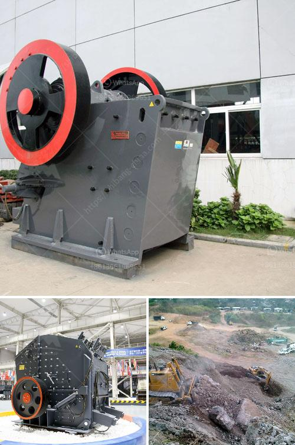

<h3>impact crusher machine</h3>
The impact crusher machine, also known as counter-breaking, is a kind of crushing equipment used for aggregate shaping and artificial sand making. It is widely used in mining, metallurgy, chemical industry, building materials, and other industries, which can finely crush various ores and rocks with different hardness. With its superior performance and outstanding advantages, the impact crusher machine has become a revolutionary breakthrough in the crushing technology.

One of the key features of the impact crusher machine is its high crushing efficiency. Compared with traditional crushers, this machine can increase the crushing efficiency by 30% to 60%. The unique design of the crushing cavity and the inter-particle crushing principle ensure the uniformity of the product size, reduce the flakiness content, and improve the particle shape. This not only enhances the product quality but also greatly reduces the energy consumption.

Another remarkable advantage of the impact crusher machine is its large feed size and high processing capacity. The maximum feed size can reach up to 800mm, and the production capacity can reach 50-800 t/h. This makes it an ideal choice for large-scale crushing operations, especially for processing materials with high hardness and moisture content. With stable performance and reliable operation, the impact crusher machine can handle various materials, including limestone, granite, concrete, and other materials with a compressive strength of less than 350 MPa.

In addition to its superior performance, the impact crusher machine has a long service life and low maintenance cost. The wear-resistant parts are made of high-quality materials, which can resist the impact and abrasion of materials and ensure the stability of the equipment operation. The wear parts are easy to replace, reducing the downtime and improving the production efficiency. Moreover, the machine is equipped with a hydraulic opening device, which can quickly and easily open the crushing cavity to replace the wear parts, making the maintenance and repair tasks much simpler.

Furthermore, the impact crusher machine has a wide range of applications. It can be used in various industries, such as mining, building materials, chemical industry, metallurgy, etc. It can crush materials with different sizes and shapes, take advantage of its unique advantages, and transform them into high-quality aggregates and artificial sand. This not only meets the needs of infrastructure construction but also promotes the development of the recycling economy and sustainable development.

In conclusion, the impact crusher machine is a powerful crushing equipment that has revolutionized the crushing technology. It has high crushing efficiency, large feed size, and high processing capacity. It is also known for its long service life, low maintenance cost, and wide range of applications. As a professional crusher manufacturer, it is crucial to choose a reliable and trustworthy supplier to ensure the quality and performance of the impact crusher machine. With the growing demand for aggregate and artificial sand, the impact crusher machine will continue to play an important role in the construction industry and make a significant contribution to economic development.
<h3>Contact us</h3><ul><li><strong>Whatsapp:&nbsp;<a href="https://wa.me/8613661969651">+8613661969651</a></strong></li><li><a href="https://swt.shibang-china.com/?git&amp;zhl&amp;impact crusher machine"><strong>Online Service(chat now)</strong></a></li></ul><h3>Related</h3><ul><li><a href='difference between underground and open cast mining.md'>difference between underground and open cast mining</a></li><li><a href='cost to open a mini cement plant.md'>cost to open a mini cement plant</a></li><li><a href='roller mill in china.md'>roller mill in china</a></li><li><a href='mobile crusher rates per hour.md'>mobile crusher rates per hour</a></li><li><a href='manufacturing process of kaolin crusher.md'>manufacturing process of kaolin crusher</a></li></ul>