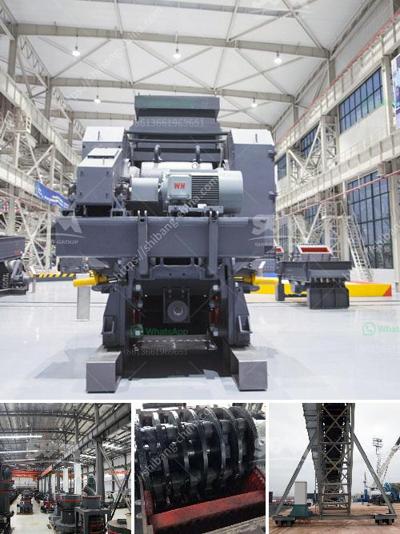

<h3>impact crusher pdf</h3>
The Impact Crusher is a versatile machine that can be used in a wide range of industries. Its main function is to reduce the size of materials, such as granite, limestone, concrete, and asphalt aggregate, into smaller pieces. These smaller pieces are suitable for further crushing or recycling purposes.

One of the key features of the Impact Crusher is its ability to handle a high volume of material. This is achieved by the use of a large feed opening and a rotor with a high rotational speed. As the material enters the crusher, it is struck by the fast-moving hammers on the rotor and is subsequently crushed. The crushed material is then discharged through adjustable curtains within the crusher.

The Impact Crusher is known for its excellent performance and high reduction ratio. It can provide a uniform particle size distribution with less fines, making it ideal for a variety of applications. Whether it is used in a quarry, recycling center, or construction site, the Impact Crusher can efficiently process a wide range of materials.

In addition to its high production capacity, the Impact Crusher offers several other advantages. One of these is its easy maintenance. The crusher is equipped with hammers that can be easily replaced when worn out. Furthermore, the curtains within the crusher can be adjusted to control the size of the final product. This flexibility allows the operator to create the desired product size and shape.

The Impact Crusher is also designed with safety in mind. It is equipped with a variety of safety features, such as a hydraulic system that prevents overload and a rotor locking device for safe and easy maintenance. Additionally, the crusher is equipped with a heavy-duty steel construction that provides durability and long-lasting performance.

In conclusion, the Impact Crusher is a reliable and versatile machine that offers high production capacity, easy maintenance, and safety features. Its ability to handle a variety of materials makes it suitable for a wide range of industries. Whether it is used for primary, secondary, or tertiary crushing, the Impact Crusher can efficiently process materials and deliver the desired product size. With its many advantages, it has become an essential tool for various applications in the crushing industry. If you are looking for a machine that can handle a high volume of material and provide a uniform particle size distribution, the Impact Crusher is a great choice.
<h3>Contact us</h3><ul><li><strong>Whatsapp:&nbsp;<a href="https://wa.me/8613661969651">+8613661969651</a></strong></li><li><a href="https://swt.shibang-china.com/?git&amp;zhl&amp;impact crusher pdf"><strong>Online Service(chat now)</strong></a></li></ul><h3>Related</h3><ul><li><a href='limestone crusher plant.md'>limestone crusher plant</a></li><li><a href='japan jaw crusher price.md'>japan jaw crusher price</a></li><li><a href='ball mill design calculation pdf.md'>ball mill design calculation pdf</a></li><li><a href='second hand stone crusher equipment medium size.md'>second hand stone crusher equipment medium size</a></li><li><a href='mobile aggregate crusher.md'>mobile aggregate crusher</a></li></ul>