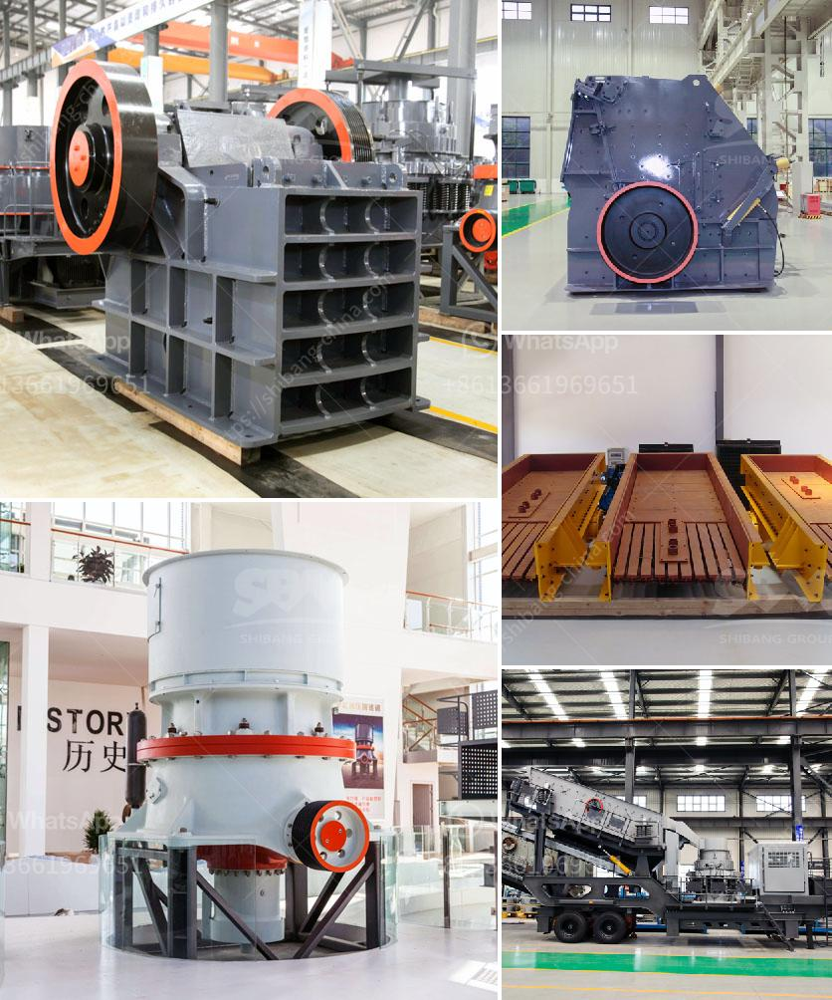

<h3>impact crusher price list</h3>
The price of impact crushers on the market is not fixed, and prices vary according to different specifications and models of equipment. As the leading manufacturer and exporter of mining machinery in China, our company has always been focusing on the research and development of crushing equipment. Over the years, our impact crushers have been exported to many countries and regions around the world, such as Southeast Asia, Africa, South America, etc.

When it comes to the price of impact crushers, it is necessary to understand that the price usually reflects the quality and performance of the equipment. Different manufacturers offer different quotation methods, such as direct sales and dealership sales. The prices offered by manufacturers are also different due to their own production costs, brand influence, and after-sales service.

In general, the price of impact crushers ranges from tens of thousands to hundreds of thousands dollars. For example, the PF-1007 impact crusher, a small-scale product, has a price lower than $10,000, while the PF-1520 impact crusher, a large-scale product, has a price higher than $100,000. In addition, the CI series impact crusher, a more advanced product with higher efficiency and greater crushing ratio, has a higher price than the PF series impact crusher.

Before making a purchase, it is important to compare prices from different manufacturers and choose a reliable and reputable supplier who can provide not only competitive prices but also good after-sales service. It is also essential to consider factors such as the quality of the equipment, the production capacity required, and the specific requirements of the project.

Furthermore, customers should also pay attention to the warranty period and the availability of spare parts. A longer warranty period and readily available spare parts can greatly reduce maintenance costs and downtime, ensuring the continuous and efficient operation of the impact crusher.

In conclusion, the price of impact crushers may vary due to various factors. Customers should conduct a comprehensive analysis and comparison before making a purchase, considering factors such as price, quality, after-sales service, and specific project requirements. By doing so, they can find a cost-effective impact crusher that meets their needs and brings them higher returns.
<h3>Contact us</h3><ul><li><strong>Whatsapp:&nbsp;<a href="https://wa.me/8613661969651">+8613661969651</a></strong></li><li><a href="https://swt.shibang-china.com/?git&amp;zhl&amp;impact crusher price list"><strong>Online Service(chat now)</strong></a></li></ul><h3>Related</h3><ul><li><a href='second hand cement mill in india.md'>second hand cement mill in india</a></li><li><a href='rent a portable conveyor belt system malaysia.md'>rent a portable conveyor belt system malaysia</a></li><li><a href='quarry jaw crusher 100tph.md'>quarry jaw crusher 100tph</a></li><li><a href='used portable roller crushers and screens scmmining.md'>used portable roller crushers and screens scmmining</a></li><li><a href='vertical grinder mill for sale.md'>vertical grinder mill for sale</a></li></ul>