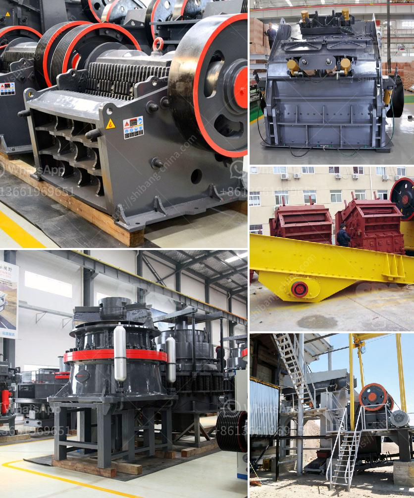

<h3>impact crusher saudi</h3>
The development of any industry relies heavily on the use of machinery and equipment. With the ever-increasing demand for metal and non-metallic minerals, cement, and aggregates, the crushing industry is experiencing a significant transformation. The impact crusher, also known as the impactor crusher, has revolutionized the crushing process. This versatile machine has enhanced the production capabilities and effectiveness of mining operations worldwide.

One of the unique features of the impact crusher is its ability to achieve selective crushing. This is possible due to an impact crushing mechanism that allows particles to be smashed against the crushing chamber’s lining, reducing grinding and minimizing wear costs. This feature makes the impact crusher particularly suitable for the crushing of harder materials like basalt and granite.

In Saudi Arabia, the impact crusher is used for crushing of rocks, minerals, and construction materials. Its working principle is simple: the materials enter the crushing chamber and collide with the breaker plates until they pass through the gap between the rotor and the breaker plates. This interaction generates an intense impact force capable of crushing the materials into smaller sizes.

The impact crusher in Saudi Arabia’s construction industry is widely used for crushing and shaping the soft, medium, and hard ores and rocks. In the initial stage, the material is poured into the jaw crusher and crushed to a certain size. After that, it is sent to the impact crusher or the cone crusher for further crushing.

The newly installed equipment in Saudi Arabia’s mining industry rapidly became the most popular device of crushing equipment, namely the impact crusher.

The impact crusher is suitable for crushing a variety of materials including limestone, granite, and concrete materials, and is widely used in the production of different types of aggregates and in mining operations. The device has a simple structure, convenient operation, and can crush various types of ore with medium and fine crushing.

The impact crusher also has the advantages of wear resistance, low failure rate, and reduced maintenance costs through the improvement of the wear-resistant component technology, the optimized improvement design of the rotor structure, the selection of domestic and foreign high-quality accessories, and the optimization of the equipment’s operating parameters. This ensures that the impact crushing machine can crush materials with a wide range of hardness and abrasive levels, providing customers with an efficient and cost-effective crushing solution.

In conclusion, the impact crusher manufactured by Saudi Arabia’s mining machinery has a high crushing ratio, uniform product size, simple structure, convenient operation, muti-cavity use, and is suitable for crushing medium-hardness materials such as limestone, slag, coke, coal and other materials in the cement, chemical, electric power, metallurgical and other industrial sectors. As Saudi Arabia aims to diversify its economy, the impact crusher provides the perfect solution for crushing construction materials, enabling contractors to turn waste into recycled materials and create a more sustainable future.
<h3>Contact us</h3><ul><li><strong>Whatsapp:&nbsp;<a href="https://wa.me/8613661969651">+8613661969651</a></strong></li><li><a href="https://swt.shibang-china.com/?git&amp;zhl&amp;impact crusher saudi"><strong>Online Service(chat now)</strong></a></li></ul><h3>Related</h3><ul><li><a href='feldspar powder ball mill.md'>feldspar powder ball mill</a></li><li><a href='vertical cement mill.md'>vertical cement mill</a></li><li><a href='stone crushing machine in zambia.md'>stone crushing machine in zambia</a></li><li><a href='used concrete crushing plant for sale in uae.md'>used concrete crushing plant for sale in uae</a></li><li><a href='crusher unit price.md'>crusher unit price</a></li></ul>