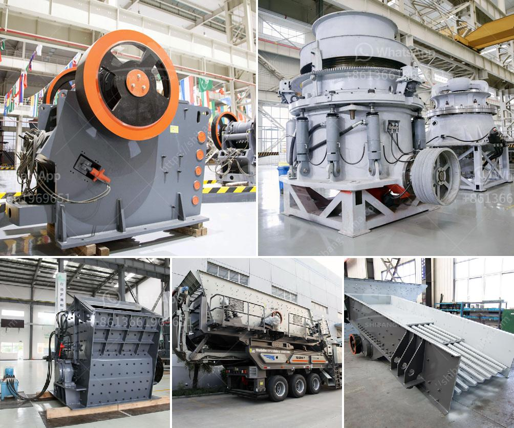

<h3>impact crusher specifications</h3>
Impact crusher, also known as the impactor crusher, is a type of crusher equipment that utilizes the impact of the materials to crush its own resolution. It is mainly used for the secondary or fine crushing operations in stone production line, sand production line, and other construction projects. The impact crusher has many specifications, and the overall design is relatively mature and advanced. 

The main specifications of impact crusher include feed opening size, maximum feeding size, production capacity, rotor diameter and width, hammer head size and quantity, and the overall dimensions. It is worth noting that the specifications vary from model to model. In general, they are directly related to the production capacity, power, input and output size, and other technical parameters of the machine.

One of the critical specifications of an impact crusher is the feed opening size, which determines the maximum feeding size of the materials it can accommodate. Typically, larger feed opening size enables the machine to accept larger materials, increasing the production capacity and efficiency. However, this also means that the impact crusher requires a larger footprint to accommodate the larger feed opening. Therefore, it is necessary to consider the balance between production capacity and space restrictions when selecting an impact crusher.

Another important specification is the maximum feeding size. This parameter refers to the largest size of the materials that the impact crusher can handle. If the size of the materials exceeds the maximum feeding size, it will cause blockage and affect the normal operation of the machine. Therefore, it is crucial to select an impact crusher with a maximum feeding size suitable for the specific materials and production requirements.

Production capacity is another critical specification of an impact crusher. It is a measure of the crusher's output or the amount of crushed materials produced per unit time. The production capacity is determined by factors such as the size and hardness of the materials, the rotor speed, the type and number of hammers, and the power of the motor. Generally, a higher production capacity means higher efficiency and better crushing performance.

The rotor diameter and width also play a significant role in the impact crusher's specifications. A larger rotor diameter and width result in a higher kinetic energy of the materials and a more efficient crushing process. This is because the larger rotor can accommodate more hammers and generate more impact force, thereby enhancing the crushing ability of the machine.

The size and quantity of the hammers are also crucial specifications. The hammers directly contact the materials and play a major role in crushing. They are subjected to high impact forces and wear. Therefore, the material, size, and quantity of the hammers should be carefully considered. Additionally, it is essential to regularly inspect and replace worn hammers to ensure the impact crusher's performance and prolong its service life.

Finally, the overall dimensions of the impact crusher are important specifications, especially when considering transportation and installation. The overall dimensions determine the size and weight of the machine and its compatibility with the available space. It is crucial to ensure that the impact crusher can be easily transported and positioned in the desired location.

In conclusion, the impact crusher specifications encompass several key parameters, including feed opening size, maximum feeding size, production capacity, rotor diameter and width, hammer head size and quantity, and overall dimensions. These specifications directly affect the machine's performance, efficiency, and usability. Therefore, it is essential to carefully consider and select the appropriate impact crusher based on the specific materials, production requirements, and space limitations.
<h3>Contact us</h3><ul><li><strong>Whatsapp:&nbsp;<a href="https://wa.me/8613661969651">+8613661969651</a></strong></li><li><a href="https://swt.shibang-china.com/?git&amp;zhl&amp;impact crusher specifications"><strong>Online Service(chat now)</strong></a></li></ul><h3>Related</h3><ul><li><a href='dubai stone crushing auction.md'>dubai stone crushing auction</a></li><li><a href='ball milling in bangalore.md'>ball milling in bangalore</a></li><li><a href='cost to setup mini cement plant in india.md'>cost to setup mini cement plant in india</a></li><li><a href='jaw rock crusher price by owner.md'>jaw rock crusher price by owner</a></li><li><a href='iron ore upgrading plant equipment.md'>iron ore upgrading plant equipment</a></li></ul>