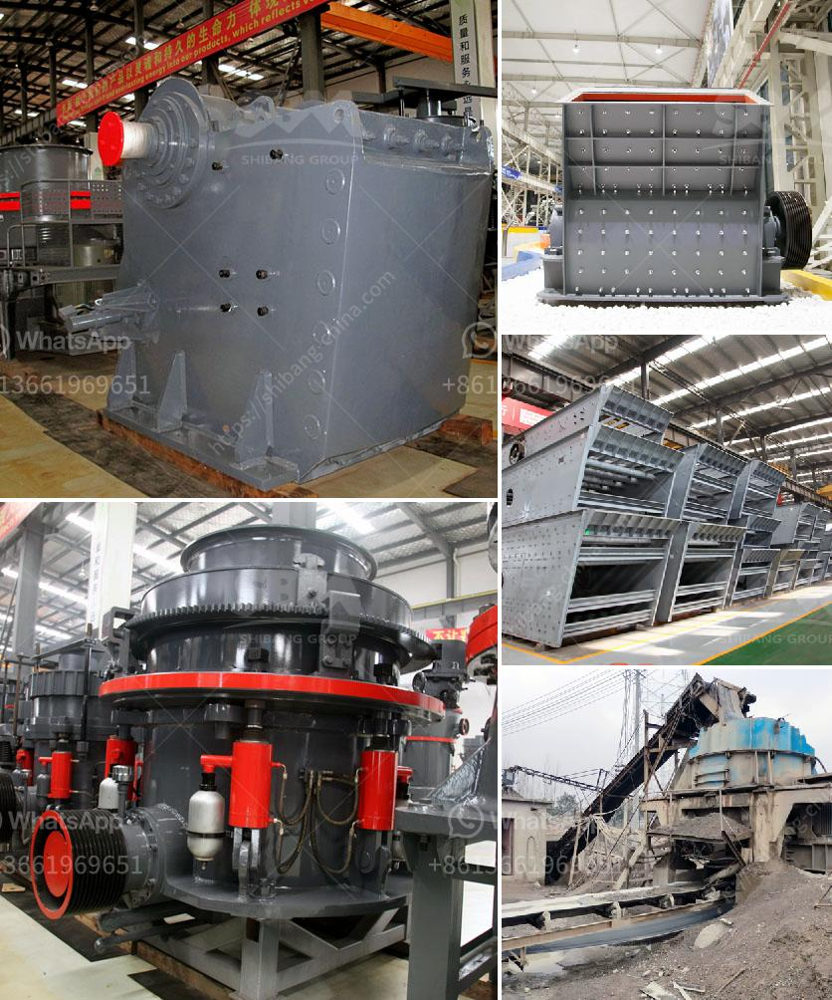

<h3>impact crushers for sale in usa</h3>
Impact crushers are powerful machines used to crush rocks and other materials into smaller, manageable pieces. These machines are commonly used in quarries, mining operations, and recycling facilities to process a variety of materials. With their high performance and efficiency, impact crushers have become a popular choice for many industries.

In the United States, there is a wide range of impact crushers for sale to choose from. These machines come in different sizes, styles, and configurations to suit diverse needs and requirements. Some of the top manufacturers and brands offering these crushers in the market include Terex, Metso, Sandvik, and Eagle Crusher.

One of the key benefits of impact crushers is their ability to produce a consistent and uniform shape of end product. Unlike other types of crushers, such as jaw crushers or cone crushers, impact crushers use impact force to break down materials. This force is created by the rapid rotation of a rotor, which accelerates the material and throws it against stationary anvils or curtains. The impact between the material and these components results in the desired size reduction.

Impact crushers are known for their high production capacity and efficiency. They can process large amounts of material in a single pass, reducing the need for multiple stages of crushing. This saves time and energy, making the crushing process more cost-effective. Additionally, these machines are equipped with adjustable settings, allowing operators to fine-tune the size of the final product according to their specific requirements.

Another advantage of impact crushers is their versatility. They can handle a wide range of materials, including hard rocks, ores, and even recycled concrete and asphalt. This makes them suitable for a variety of applications, such as road construction, building materials production, and mining operations.

When considering buying an impact crusher in the USA, there are several factors to take into account. First, determine the required capacity and size of the machine based on your production needs. Consider the type of material you will be processing, as some impact crushers are better suited for specific materials. For example, some models are designed for primary crushing, while others are more suitable for secondary or tertiary crushing.

Additionally, assess the durability and reliability of the machine. Look for impact crushers made from high-quality materials and equipped with robust components that can withstand heavy-duty use. Check for features such as high-strength frames, durable rotors, and easy-access maintenance areas, as these can contribute to the machine's overall performance and longevity.

Furthermore, consider the after-sales support and service provided by the manufacturer or dealer. Ensure they offer technical assistance, spare parts availability, and warranty options to guarantee a smooth operation and minimize downtime.

In conclusion, impact crushers for sale in the USA provide a powerful and efficient solution for crushing a variety of materials. Their ability to produce a consistent and uniform shape of the end product, high production capacity, and versatility make them a popular choice for many industries. When purchasing an impact crusher, consider the required capacity, material type, durability, and after-sales support to ensure you choose the right machine for your needs.
<h3>Contact us</h3><ul><li><strong>Whatsapp:&nbsp;<a href="https://wa.me/8613661969651">+8613661969651</a></strong></li><li><a href="https://swt.shibang-china.com/?git&amp;zhl&amp;impact crushers for sale in usa"><strong>Online Service(chat now)</strong></a></li></ul><h3>Related</h3><ul><li><a href='feldspar powder ball mill.md'>feldspar powder ball mill</a></li><li><a href='aggregate washing machine.md'>aggregate washing machine</a></li><li><a href='movable stone crusher.md'>movable stone crusher</a></li><li><a href='mobile crushing plant manufacturers.md'>mobile crushing plant manufacturers</a></li><li><a href='washing plant mining prices.md'>washing plant mining prices</a></li></ul>