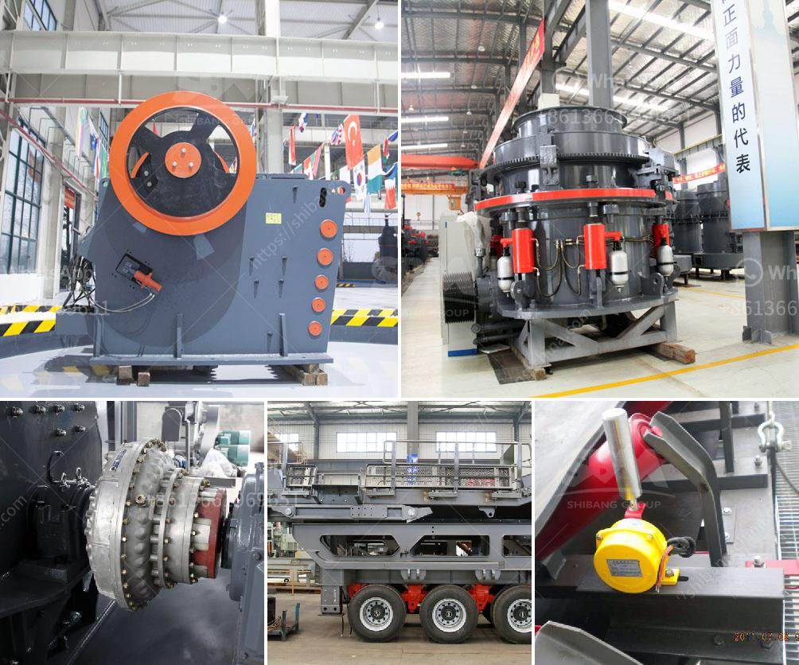

<h3>impact crushers nigeria</h3>
Impact crushers are designed to crush materials with a high content of elongated particles, such as granite, limestone, and gravel. Nigeria is a country blessed with abundant natural resources, including solid minerals such as limestone, granite, and gravel. Therefore, the impact crusher machine is widely used in these areas.

As mining continues to lead in Nigeria, stone crushing is an essential part of the industry. As the natural resources in the country are becoming depleted, the relevance of the impact crusher machines becomes more apparent. Impact crushers are used to break rocks with low hardness (soft - medium rock) materials, such as limestone, basalt, and granite.

The high energy efficiency of impact crushers allows for a reduction in energy consumption compared to other crushing methods. This is particularly important in Nigeria, where access to constant electricity can be a challenge. By using impact crushers, operators can reduce operating costs and improve productivity. Additionally, the high crushing ratio of impact crushers ensures that more materials can be crushed in a shorter time, increasing overall efficiency.

In Nigeria, impact crushers are commonly used for the primary and secondary crushing stages. They reduce the size of materials such as limestone, concrete, and asphalt into smaller pieces for further processing or recycling. This is especially important in the construction industry, where crushed materials are used for building roads, bridges, and buildings.

One of the significant advantages of impact crushers is their ability to produce a wide range of well-graded products. The adjustable curtains and impact plates allow operators to control both the size and shape of the final product. This flexibility is crucial in Nigeria, where different specifications are required for various construction projects. Impact crushers also provide excellent cubical shape, which is highly desirable for producing high-quality aggregates.

Furthermore, impact crushers are relatively easy to maintain compared to other crushing machines. Regular maintenance and inspection of various components, such as hammer and rotor, can extend the lifespan of the equipment and ensure its efficiency during operations. This is vital in Nigeria, where maintenance services and spare parts may not always be readily available.

To meet the increasing demand for crushed rock materials in Nigeria, manufacturers have continuously improved the design and performance of impact crushers. Today, impact crushers come in various sizes and capacities, suitable for different applications. Whether used in mining, quarrying, or recycling operations, impact crushers have become an invaluable tool for the construction industry in Nigeria.

In conclusion, impact crushers have a significant impact on Nigeria's construction industry due to their ability to efficiently crush various materials and produce well-graded products. The energy efficiency, productivity, and versatility of impact crushers make them essential equipment in the stone crushing process. As Nigeria continues to grow, so does the demand for crushed rock materials, making the impact crusher a vital tool for the country's infrastructure development.
<h3>Contact us</h3><ul><li><strong>Whatsapp:&nbsp;<a href="https://wa.me/8613661969651">+8613661969651</a></strong></li><li><a href="https://swt.shibang-china.com/?git&amp;zhl&amp;impact crushers nigeria"><strong>Online Service(chat now)</strong></a></li></ul><h3>Related</h3><ul><li><a href='portable stone crusher for sale india price.md'>portable stone crusher for sale india price</a></li><li><a href='feldspar powder plants in andhra pradesh.md'>feldspar powder plants in andhra pradesh</a></li><li><a href='quartz silica crusher plant sale at telangana.md'>quartz silica crusher plant sale at telangana</a></li><li><a href='stone crusher in stone.md'>stone crusher in stone</a></li><li><a href='mini cement plant capacity of 5 ton per day.md'>mini cement plant capacity of 5 ton per day</a></li></ul>