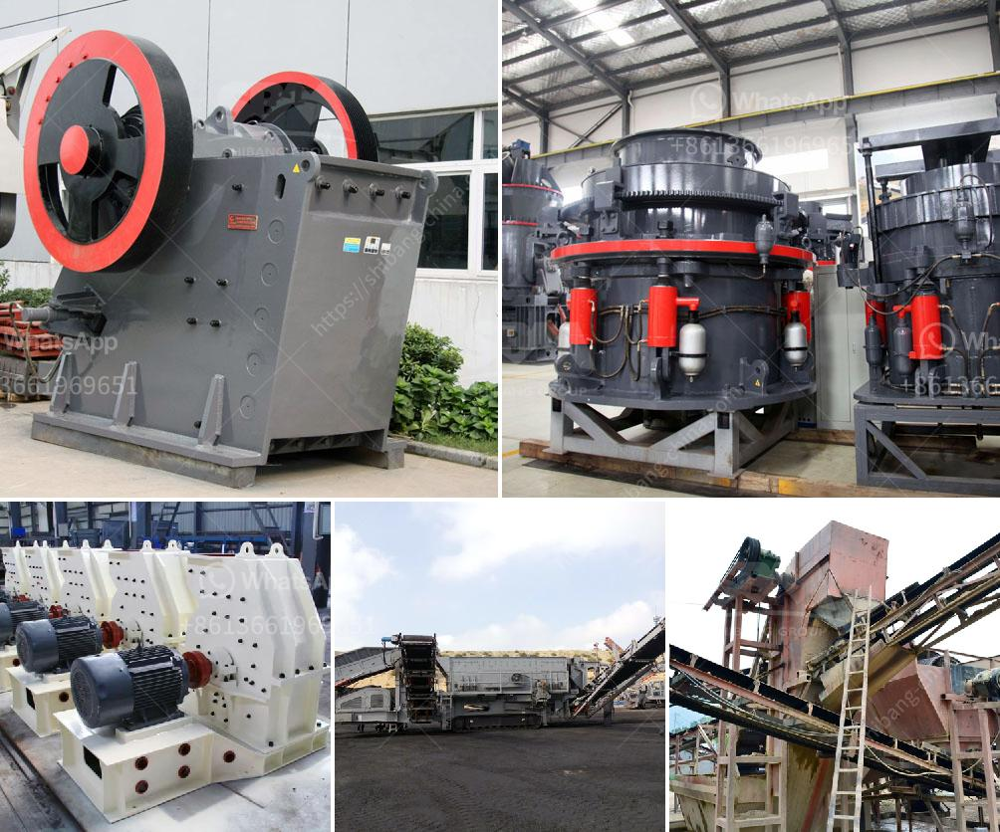

<h3>india jaw crusher of small capacity</h3>
India, being one of the fastest growing economies, has expanded its infrastructure and raised the demand for construction materials and stones. This has led to the increased need for efficient and high-performing stone crushing equipment. Keeping up with the demand, the Indian market has witnessed the introduction of various types of jaw crushers of small capacity.

The jaw crusher is a vital piece of equipment in many industries, including mining, construction, quarrying, recycling, and demolition. Designed to crush a wide range of materials, these machines have evolved over the years to become efficient and user-friendly.

In recent years, India has experienced a surge in infrastructure projects, which has created a need for high-quality aggregates. To meet this demand, manufacturers have developed small capacity jaw crushers that are powerful, yet compact. These crushers are designed to efficiently break down stones, making them perfect for use in small to medium-sized construction projects.

One such jaw crusher model that India has witnessed is the CT series from Propel Industries. This jaw crusher is specifically designed for quarrying and demolition purposes. Equipped with an advanced hydraulic system, the CT series ensures easy and comfortable operation, making it an ideal choice for small-scale projects.

The CT series jaw crusher is available in two different sizes: CT 750 and CT 1000. The smaller model, CT 750, is capable of handling materials with a feed size of up to 650 mm, while the larger CT 1000 can handle rocks up to 850 mm. Both models come with a minimum closed-side setting (CSS) of 75 mm, ensuring a smooth and consistent output.

One of the key features of the CT series jaw crusher is its efficient design, which allows for easy maintenance. With a reversible jaw plate and a replaceable wear plate, the CT series ensures minimal downtime and longer lifespan of the equipment. Furthermore, the jaw crusher comes with an integrated motor frame, reducing the overall size of the machine and making it easy to transport.

Another important aspect of the CT series jaw crusher is its energy efficiency. Powered by a high-quality motor, this equipment consumes less power compared to other similar models. This not only helps in reducing operational costs but also contributes to a greener environment.

The small capacity of the CT series jaw crusher makes it an ideal choice for areas with limited space. Whether it is a small quarry or a construction site with restricted access, the compact design of this equipment ensures easy maneuverability. Additionally, the crusher can be mounted on a trailer, allowing for easy transportation between different job sites.

In conclusion, the introduction of jaw crushers of small capacity in India has revolutionized the stone crushing industry. These high-performing machines are not only portable and efficient but also cost-effective, making them an essential equipment for any construction project. As technology continues to advance, we can expect further improvements in the design and functionality of these jaw crushers, providing even more benefits to the Indian market.
<h3>Contact us</h3><ul><li><strong>Whatsapp:&nbsp;<a href="https://wa.me/8613661969651">+8613661969651</a></strong></li><li><a href="https://swt.shibang-china.com/?git&amp;zhl&amp;india jaw crusher of small capacity"><strong>Online Service(chat now)</strong></a></li></ul><h3>Related</h3><ul><li><a href='gold stone crusher machine south africa.md'>gold stone crusher machine south africa</a></li><li><a href='gold sand processing technology.md'>gold sand processing technology</a></li><li><a href='quarry equipment in kenya.md'>quarry equipment in kenya</a></li><li><a href='roller mill price.md'>roller mill price</a></li><li><a href='iron ore upgrading plant equipment.md'>iron ore upgrading plant equipment</a></li></ul>