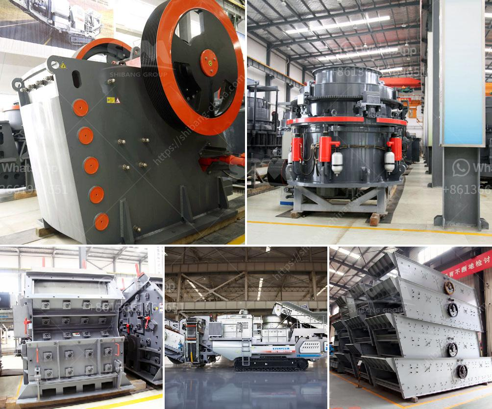

<h3>india sand crusher</h3>
India, a country known for its diverse culture and rich heritage, has been witnessing significant growth in its construction sector over the past few years. With the government's focus on the development of infrastructure and housing projects, the demand for sand, a key raw material, has been soaring. To meet this escalating demand, the Indian construction industry has turned to advanced sand crushers.

Gone are the days when manual labor was used to obtain sand through traditional methods like riverbed mining. The advent of sand crushers in India has revolutionized the construction industry by providing an efficient alternative for the extraction of sand. These machines have proven to be a game-changer for India's construction sector.

A sand crusher is a device that is used to crush stones or rocks into smaller particles. The sand crusher is a highly efficient piece of equipment that minimizes waste, saves time, and reduces dependency on manual labor. These machines utilize cutting-edge technology and can crush rocks or stones of various sizes, making them suitable for different construction purposes.

One of the significant advantages of using sand crushers is the consistency in the quality of the crushed sand. Traditional sand extraction methods often result in impurities, uneven particle sizes, and varying quality. On the other hand, sand crushers ensure a uniform and high-quality product, which is crucial for construction purposes, including making concrete, plastering, and road building.

The sand crushers have also proved to be environmentally friendly options. Indiscriminate sand extraction from rivers has been a significant concern as it leads to erosion, loss of biodiversity, and disruption to aquatic ecosystems. The use of sand crushers reduces the dependency on riverbed sand, thereby mitigating these environmental issues.

In addition to the environmental benefits, sand crushers are also cost-effective in the long run. They require minimal maintenance and have a high operational efficiency, resulting in increased productivity. Moreover, the use of crushed sand reduces the demand for natural sand, which is often costly and scarce. This, in turn, helps in stabilizing the sand prices, ensuring affordability and availability for the construction industry.

Furthermore, sand crushers enable the utilization of waste materials in the construction process. For instance, crushed stones or rocks from demolition sites can be recycled and used as a substitute for natural sand. This reduces the burden on landfills and promotes a sustainable approach to construction.

The increasing demand for sand crushers in India has sparked a surge in their manufacturing. Many Indian companies have started producing sand crushers to meet the rising demand. This localized manufacturing has not only provided employment opportunities but has also brought down the cost of these machines.

In conclusion, sand crushers have emerged as a reliable and cost-effective solution for meeting India's soaring demand for sand. With their advanced technology, consistent quality output, and environmental benefits, these machines have become integral to the country's construction sector. As India continues its stride towards robust infrastructure development, the adoption of sand crushers will play a vital role in ensuring sustainable growth and propelling the nation towards its vision of a developed economy.
<h3>Contact us</h3><ul><li><strong>Whatsapp:&nbsp;<a href="https://wa.me/8613661969651">+8613661969651</a></strong></li><li><a href="https://swt.shibang-china.com/?git&amp;zhl&amp;india sand crusher"><strong>Online Service(chat now)</strong></a></li></ul><h3>Related</h3><ul><li><a href='vibrating screen consumption.md'>vibrating screen consumption</a></li><li><a href='coarse ash grinding mill equipment.md'>coarse ash grinding mill equipment</a></li><li><a href='tertiary stone crusher.md'>tertiary stone crusher</a></li><li><a href='cement clinker processing equipment.md'>cement clinker processing equipment</a></li><li><a href='silica water washing plant price.md'>silica water washing plant price</a></li></ul>