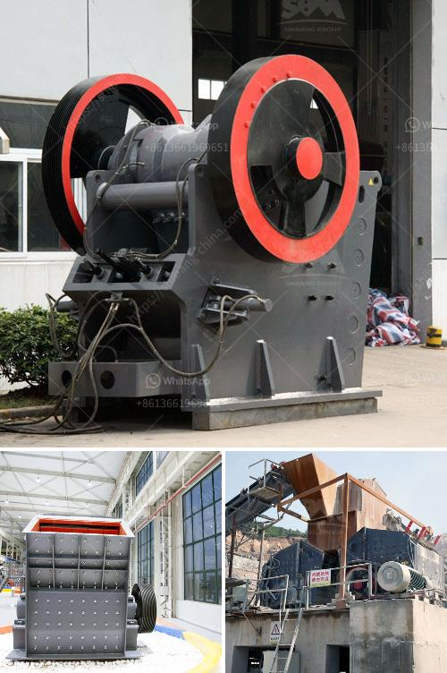

<h3>industrial application of pebble mill</h3>
The industrial application of pebble mills has become increasingly prevalent in various industries due to their numerous advantages and versatility. A pebble mill, also known as a tumbling mill, is a milling machine that consists of a hollow cylinder with balls or pebbles made of ceramic, metal, or rubber. These balls or pebbles impact, grind, or tumble the material to be milled, resulting in size reduction and particle dispersion.

One of the significant industrial applications of pebble mills is in the ceramic industry. Ceramic materials require precise and controlled grinding to achieve the desired particle size and distribution. Pebble mills provide an excellent solution for this purpose due to their ability to grind and mix ceramic raw materials effectively. The size reduction and mixing process of ceramic materials in a pebble mill result in the formation of a homogeneous and well-dispersed blend, which is crucial to enhancing the quality of ceramic products.

Another industrial application of pebble mills is in the mining industry. These mills are commonly used for grinding ores and minerals, resulting in the extraction of valuable minerals from the ore. The tumbling action of the pebbles or balls in the mill breaks down the ore into fine particles, enabling easier separation and extraction of minerals. Moreover, pebble mills can be used in both wet and dry grinding processes, making them highly versatile for various types of ores and minerals.

Pebble mills also find extensive application in the pharmaceutical industry. Many pharmaceutical products require size reduction and particle size control. The use of pebble mills allows pharmaceutical manufacturers to precisely control the product's particle size, resulting in improved dissolution rates and better bioavailability. Additionally, pebble mills provide a contamination-free grinding environment, essential for pharmaceutical products that require high levels of purity.

The chemical industry also benefits from the industrial application of pebble mills. Chemical processes often involve the grinding of materials to enhance reactivity or reduce particle size for better handling and mixing. Pebble mills offer an efficient and reliable method to achieve the desired particle size distribution in chemical reactions. Furthermore, the use of pebble mills minimizes the risk of unwanted chemical reactions and contamination, ensuring the integrity and quality of the final product.

Other industrial applications of pebble mills include the food and beverage industry, where the grinding and mixing of food ingredients are needed, and the paint and coatings industry, where the dispersion of pigments in a liquid medium is essential for producing high-quality coatings.

In conclusion, pebble mills have proven to be vital industrial equipment with a wide range of applications. Whether in the ceramic, mining, pharmaceutical, chemical, food, or paint industry, pebble mills offer efficient size reduction, particle dispersion, and mixing capabilities. Their versatility, reliability, and ability to provide a contamination-free grinding environment make them a preferred choice in many industrial processes. As industries continue to seek enhanced efficiency and product quality, the industrial application of pebble mills is expected to expand further in the future.
<h3>Contact us</h3><ul><li><strong>Whatsapp:&nbsp;<a href="https://wa.me/8613661969651">+8613661969651</a></strong></li><li><a href="https://swt.shibang-china.com/?git&amp;zhl&amp;industrial application of pebble mill"><strong>Online Service(chat now)</strong></a></li></ul><h3>Related</h3><ul><li><a href='complete stone crusher plant manufacturer from italy.md'>complete stone crusher plant manufacturer from italy</a></li><li><a href='quarry stone crushers for sale.md'>quarry stone crushers for sale</a></li><li><a href='stone crusher usa.md'>stone crusher usa</a></li><li><a href='crushing machine manufacturers cape town.md'>crushing machine manufacturers cape town</a></li><li><a href='feldspar milling market.md'>feldspar milling market</a></li></ul>