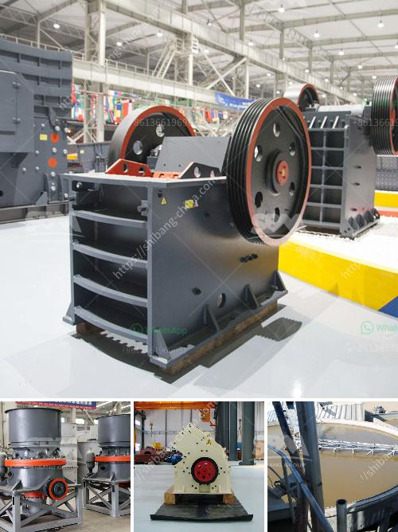

<h3>industrial ball mills</h3>
Industrial ball mills are an essential tool in the mining and mineral processing industries. The primary function of these mills is to grind large rocks into smaller sizes. They offer various advantages over other grinding methods, such as the ability to produce a fine grind and a homogeneous product size distribution.

Ball mills consist of a rotating horizontal cylinder, partially filled with a grinding medium, such as steel balls, that relies on the impact and attrition between the balls. The materials are then ground by the movement of the balls as they collide with the material being processed.

One key advantage of ball mills is their ability to achieve a fine grind at a low cost. A ball mill with a diameter of several meters grinds down rocks into extremely fine particles. The grinding process is conducted in a controlled manner, ensuring that the desired product size is achieved consistently.

Another advantage of ball mills is their versatility. They can be used for both dry and wet grinding processes, making them suitable for a wide range of applications. Dry grinding is more common in mineral processing operations, while wet grinding is more prevalent in the cement and other industries.

Ball mills are also characterized by their high grinding efficiency. The grinding media in the ball mill is lifted and impacted by the rotating grinding media, resulting in a cascading effect that further reduces the size of the material. This ensures that the material is sufficiently ground to achieve the desired fineness.

Additionally, ball mills are relatively simple machines when compared to other grinding techniques. They require minimal maintenance and are easy to operate. The low operating and maintenance costs make ball mills an attractive option for many mining and mineral processing operations.

However, there are some considerations when using ball mills. Firstly, the grinding media must be durable and resistant to wear to ensure a long service life. Secondly, the ball mill must have sufficient power to grind the material effectively. This can be achieved through the selection of a suitable motor and a proper grinding media size and shape.

In conclusion, industrial ball mills are an essential tool in the mining and mineral processing industries. They offer several advantages, including fine grinding capability, versatility, and high grinding efficiency. However, proper selection of equipment and maintenance are critical to ensuring optimal performance and longevity. With the right approach, ball mills can provide cost-effective solutions for various grinding applications.
<h3>Contact us</h3><ul><li><strong>Whatsapp:&nbsp;<a href="https://wa.me/8613661969651">+8613661969651</a></strong></li><li><a href="https://swt.shibang-china.com/?git&amp;zhl&amp;industrial ball mills"><strong>Online Service(chat now)</strong></a></li></ul><h3>Related</h3><ul><li><a href='stone crusher machine uk.md'>stone crusher machine uk</a></li><li><a href='puzzolana jaw crusher price in india.md'>puzzolana jaw crusher price in india</a></li><li><a href='mobile cil gold processing plant.md'>mobile cil gold processing plant</a></li><li><a href='used aggregate crushing plant for sale.md'>used aggregate crushing plant for sale</a></li><li><a href='mobile screening machine south africa.md'>mobile screening machine south africa</a></li></ul>