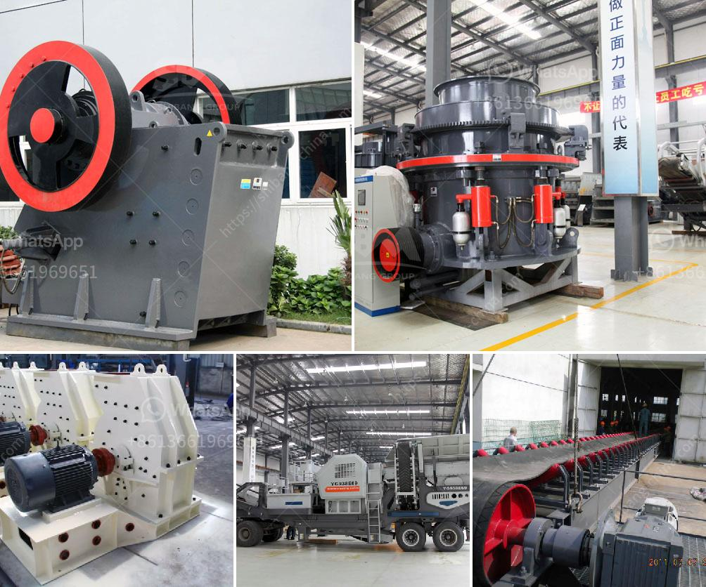

<h3>industrial cone crusher</h3>
The industrial cone crusher is a type of crushing equipment that effectively utilizes the principle of crushing through repeated impacts. However, unlike traditional jaw crushers or gyratory crushers, cone crushers use compression to break up the raw materials. It works by squeezing the materials between an eccentrically gyrating spindle and a concave hopper.

One of the key advantages of the industrial cone crusher is its ability to process a wide range of different materials. This makes it ideal for industries such as mining, quarrying, and recycling, where materials of varying hardness and abrasiveness need to be crushed. Whether it is hard and abrasive rock or softer materials like limestone or sandstone, the cone crusher can handle them all.

In addition to its versatility, the industrial cone crusher also offers high efficiency and productivity. The unique design of the crushing chamber enables the materials to be crushed in multiple stages, allowing for greater reduction ratios and finer product sizes. This means that more materials can be processed in a single pass, leading to increased throughput and shorter processing times.

Furthermore, the cone crusher is equipped with advanced technology and features to ensure optimal performance and ease of operation. For example, many cone crushers are equipped with automatic setting adjustment systems that allow for precise and consistent product sizes. This not only improves the overall efficiency of the crusher but also minimizes the risk of damage to the machine and reduces downtime.

Another important feature of the industrial cone crusher is its versatility in terms of crushing configurations. Depending on the specific requirements of the application, cone crushers can be operated in different modes, such as closed circuit crushing or open circuit crushing. This flexibility allows operators to optimize the crusher's performance for different materials and desired end products.

In terms of maintenance, the industrial cone crusher is designed to be durable and reliable. The robust construction and high-quality components ensure that the crusher can withstand the harsh operating conditions often encountered in industrial applications. Additionally, many cone crushers are equipped with easy-to-access maintenance points, making it easier for operators to perform routine maintenance tasks and inspections.

Overall, the industrial cone crusher is a reliable and efficient crushing solution for a variety of industries. Its ability to process a wide range of materials, high productivity, and ease of operation make it an ideal choice for various applications. Whether it is used in mining, quarrying, or recycling, the cone crusher offers a cost-effective and reliable solution for crushing needs.
<h3>Contact us</h3><ul><li><strong>Whatsapp:&nbsp;<a href="https://wa.me/8613661969651">+8613661969651</a></strong></li><li><a href="https://swt.shibang-china.com/?git&amp;zhl&amp;industrial cone crusher"><strong>Online Service(chat now)</strong></a></li></ul><h3>Related</h3><ul><li><a href='jaw and cone crusher.md'>jaw and cone crusher</a></li><li><a href='china crusher sale.md'>china crusher sale</a></li><li><a href='calcium carbonate plant industry.md'>calcium carbonate plant industry</a></li><li><a href='used mining equipment uk.md'>used mining equipment uk</a></li><li><a href='mobile quarry plant.md'>mobile quarry plant</a></li></ul>