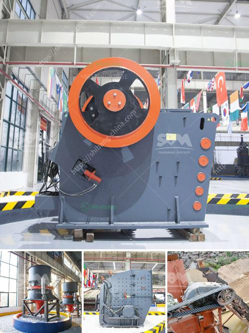

<h3>industrial crusher machine</h3>
In the world of heavy-duty equipment, the industrial crusher machine stands out for its ability to break down and crush all kinds of materials. These rugged and versatile machines come in a variety of sizes and styles to meet the diverse needs of numerous industries.

The primary purpose of an industrial crusher machine is to reduce the size of raw materials like rocks, minerals, and ore into smaller pieces. This process ensures the efficient extraction and utilization of valuable resources while minimizing waste. By compacting and crushing materials, these machines make it easier to handle, transport, and process bulk materials.

One key feature of industrial crusher machines is their ability to perform consistently and reliably even in demanding operating conditions. Made from durable materials, these machines are built to endure heavy use, withstand abrasive materials, and resist wear and tear. With high-capacity motors and powerful crushing mechanisms, industrial crushers can efficiently process large volumes of materials without compromising on performance.

Another advantage of using an industrial crusher machine is its versatility. These machines can handle a wide range of materials, including coal, limestone, clay, gypsum, concrete, and more. By adjusting the settings, operators can achieve the desired product size and shape. This adaptability makes industrial crushers suitable for various applications, such as mining, construction, recycling, and demolition.

Furthermore, many industrial crusher machines are equipped with safety features to protect operators and prevent accidents. These include emergency stops, locking mechanisms, and automatic overload protection systems. With proper maintenance and regular inspections, these machines can provide years of reliable service while ensuring the safety of personnel.

In conclusion, industrial crusher machines play a crucial role in breaking down materials for further processing. Their robust construction, high-performance capabilities, and versatility make them indispensable tools for numerous industries. By reducing the size and preparing materials for efficient use, these machines contribute to resource conservation and overall operational efficiency.
<h3>Contact us</h3><ul><li><strong>Whatsapp:&nbsp;<a href="https://wa.me/8613661969651">+8613661969651</a></strong></li><li><a href="https://swt.shibang-china.com/?git&amp;zhl&amp;industrial crusher machine"><strong>Online Service(chat now)</strong></a></li></ul><h3>Related</h3><ul><li><a href='fine powder grinding machine philippines.md'>fine powder grinding machine philippines</a></li><li><a href='jaw crusher for barite crushing.md'>jaw crusher for barite crushing</a></li><li><a href='stone crusher hospital dhaka.md'>stone crusher hospital dhaka</a></li><li><a href='ball mill design calculation pdf.md'>ball mill design calculation pdf</a></li><li><a href='quarring of building stones crusher in pakistan.md'>quarring of building stones crusher in pakistan</a></li></ul>