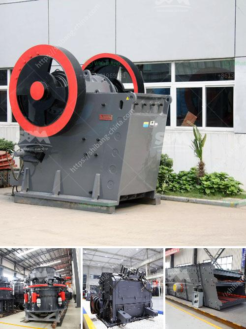

<h3>industrial fine powder grinding machinery</h3>
Industrial fine powder grinding machinery is designed for efficient and economical production of fine powders. With the advancement of technology, industrial grinding mills have significantly improved in terms of production capacity and energy consumption. These machines are widely used in various industries, including mining, metallurgy, chemical engineering, building materials, and more.

One of the main advantages of industrial fine powder grinding machinery is its ability to produce high-quality powders with a narrow particle size distribution. This is crucial in many industries where powders need to meet specific requirements for their applications. For example, in the pharmaceutical industry, powders are often required to have uniform particle size to ensure consistent dosage and drug efficacy.

In addition to particle size control, industrial fine powder grinding machinery also offers other benefits. For instance, these machines are highly efficient, allowing for large quantities of material to be processed within a short period. This not only saves time but also reduces production costs.

Another advantage of industrial grinding mills is their flexibility in terms of the type of materials they can process. These machines can grind a wide range of materials, including minerals, chemicals, food products, and more. This versatility makes them suitable for a variety of industries and applications.

Moreover, industrial fine powder grinding machinery can be equipped with various accessories and features to meet specific processing needs. For example, some mills have integrated classifiers to separate fine powders from coarse particles, while others have cooling or heating systems to control the temperature during grinding.

Overall, industrial fine powder grinding machinery plays a crucial role in many industries by producing high-quality powders efficiently and cost-effectively. With continuous advancements in technology, these machines are likely to become even more versatile and efficient in the future. Therefore, investing in this machinery can be a smart choice for companies looking to optimize their powder production processes.
<h3>Contact us</h3><ul><li><strong>Whatsapp:&nbsp;<a href="https://wa.me/8613661969651">+8613661969651</a></strong></li><li><a href="https://swt.shibang-china.com/?git&amp;zhl&amp;industrial fine powder grinding machinery"><strong>Online Service(chat now)</strong></a></li></ul><h3>Related</h3><ul><li><a href='sand crusher machine hyderabad for sale.md'>sand crusher machine hyderabad for sale</a></li><li><a href='mini cement plant capacity of 5 ton per day.md'>mini cement plant capacity of 5 ton per day</a></li><li><a href='equipment roller mill.md'>equipment roller mill</a></li><li><a href='turkey cone crusher.md'>turkey cone crusher</a></li><li><a href='malaysia gravel crusher machine.md'>malaysia gravel crusher machine</a></li></ul>