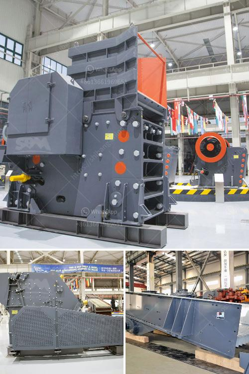

<h3>industrial mineral silica sand</h3>
Silica sand, also known as industrial sand, is one of the most abundant minerals on Earth and plays a crucial role in various industries. It is mainly composed of silicon dioxide (SiO2) and is primarily found in the form of quartz. Silica sand is known for its high purity and exceptional physical properties, making it an essential raw material for a wide range of applications.

One of the key uses of silica sand is in glass manufacturing. It is a primary component in the production of glass, providing the clarity, strength, and durability that make glass products visually appealing, safe, and long-lasting. From windows and bottles to mirrors and flat panel displays, the quality of silica sand directly impacts the quality of the glass product.

Silica sand is also widely used in the construction industry. It is a key ingredient in concrete, where its high silica content enhances the strength and durability of the material. In addition, it is used as a component in asphalt mixtures to improve the pavement's resistance to wear and tear. Additionally, silica sand is used as a proppant in hydraulic fracturing, or fracking, to extract oil and gas from deep underground. It helps keep fractures open, allowing the oil and gas to flow more freely.

Another major industry that relies on silica sand is the foundry industry. Foundries use silica sand as the main molding material in the production of metal castings. The sand is shaped into molds and then molten metal is poured into the mold cavity. Silica sand provides the necessary refractory properties to withstand high temperatures, ensuring the mold's durability and integrity during the casting process.

Silica sand is also used in water filtration systems. Its high purity and uniform particle size make it an efficient filter media for removing impurities and contaminants from water. Whether it's in swimming pools, drinking water treatment plants, or industrial water treatment, silica sand helps ensure clean and safe water supplies.

In addition to these major industries, silica sand finds application in cosmetics, ceramics, paints and coatings, plastics, and many other sectors. Its unique physical properties, such as high melting point, low thermal expansion, and resistance to chemicals, make it an ideal choice for a wide range of specialized applications.

However, it is important to note that the extraction and processing of silica sand can have environmental concerns. Mining operations can impact ecosystems, water resources, and air quality if not properly managed. Stricter regulations and sustainable mining practices are necessary to mitigate these potential impacts and ensure the responsible extraction of silica sand.

In conclusion, silica sand is a versatile and indispensable mineral that contributes to numerous industries. Its high purity, exceptional physical properties, and abundance make it an invaluable raw material. From glass manufacturing to construction, water filtration to foundry applications, silica sand plays a vital role in modern society. As demand for these applications continues to grow, it is important to balance the benefits of silica sand with responsible mining practices to protect our environment.
<h3>Contact us</h3><ul><li><strong>Whatsapp:&nbsp;<a href="https://wa.me/8613661969651">+8613661969651</a></strong></li><li><a href="https://swt.shibang-china.com/?git&amp;zhl&amp;industrial mineral silica sand"><strong>Online Service(chat now)</strong></a></li></ul><h3>Related</h3><ul><li><a href='belt jaw crusher nigeria.md'>belt jaw crusher nigeria</a></li><li><a href='rock crusher plants in germany.md'>rock crusher plants in germany</a></li><li><a href='dry grinding ball mill.md'>dry grinding ball mill</a></li><li><a href='capacity 1 to 5 tons per hour price.md'>capacity 1 to 5 tons per hour price</a></li><li><a href='difference between chain and belt conveyors.md'>difference between chain and belt conveyors</a></li></ul>