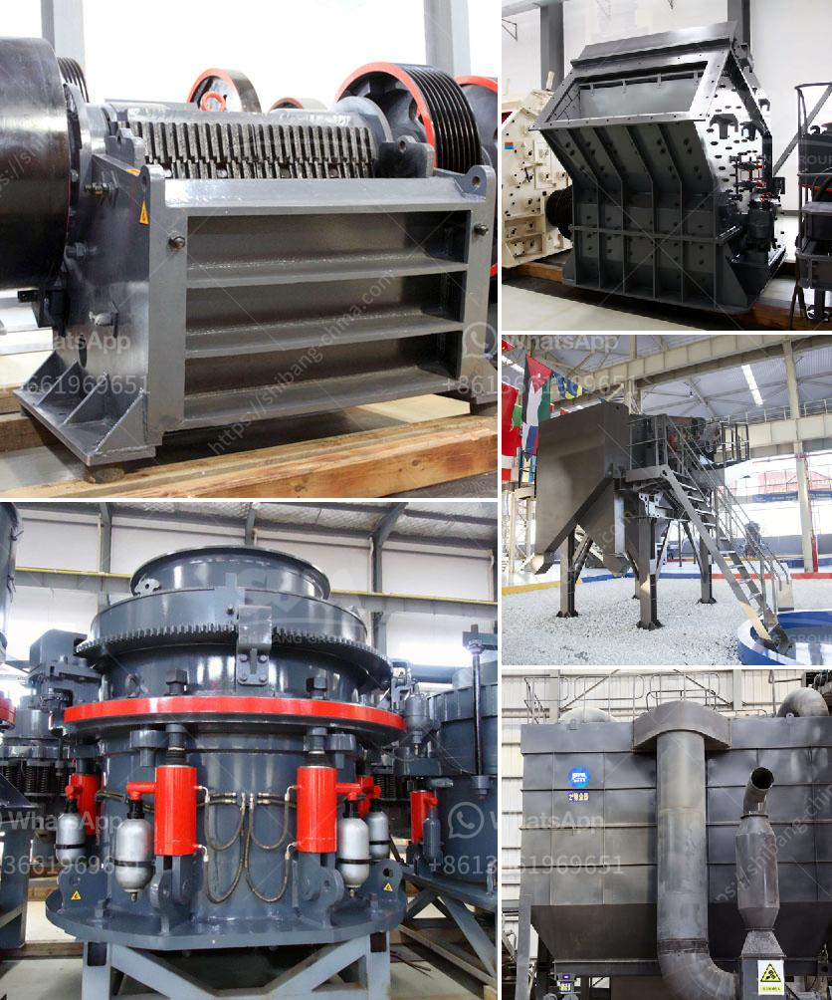

<h3>iron mining crusher</h3>
Iron mining crusher is a machine that is utilized to extract iron ore from the earth’s crust. This is a primary stage process that involves the use of explosives to break up the ore and then transport it to the surface. Mining crushers are heavy-duty machinery that break down large rocks into manageable sizes for transportation purposes. Crushing is an essential process in iron ore mining as it ensures that the minerals are efficiently extracted from the earth. Iron ore is a naturally occurring mineral comprising of iron oxide or iron sulfide that can be found in sedimentary, metamorphic, or igneous rocks.

The process of mining iron ore requires massive resources. These resources include heavy machinery, such as crushers, screeners, drills, and loaders, which help in the process of extracting iron ore. Among the key crushing machines used in this process are cone and jaw crushers. These two machines are responsible for breaking down the larger rocks by compressing them into smaller pieces. The smaller particles are then transported to the ore processing plants where further crushing, grinding, magnetic separation, and filtration take place.

The iron mining crusher performs the crushing process in a rotating motion driven by an electric motor. As a result, it breaks down large rocks into smaller, more manageable sizes. These crushed rocks can be further processed depending on the required iron content and any other impurities present. The resulting iron ore is then transported to refining plants where it undergoes further processing before it is ready for use.

In conclusion, the iron mining crusher plays a crucial role in the iron ore mining process. It is the first step in extracting the valuable minerals from the earth. With the help of heavy-duty machinery, the crusher breaks down large rocks into smaller, more manageable sizes. This facilitates the transportation and subsequent processing of iron ore to extract the desired iron content.
<h3>Contact us</h3><ul><li><strong>Whatsapp:&nbsp;<a href="https://wa.me/8613661969651">+8613661969651</a></strong></li><li><a href="https://swt.shibang-china.com/?git&amp;zhl&amp;iron mining crusher"><strong>Online Service(chat now)</strong></a></li></ul><h3>Related</h3><ul><li><a href='mobile crusher and screening plant.md'>mobile crusher and screening plant</a></li><li><a href='machine layout gypsum board manufacturing.md'>machine layout gypsum board manufacturing</a></li><li><a href='used industrial dryer for sale in india.md'>used industrial dryer for sale in india</a></li><li><a href='how is calcite used to manufacture paper.md'>how is calcite used to manufacture paper</a></li><li><a href='cebu supplier of disposable jaw crusher.md'>cebu supplier of disposable jaw crusher</a></li></ul>