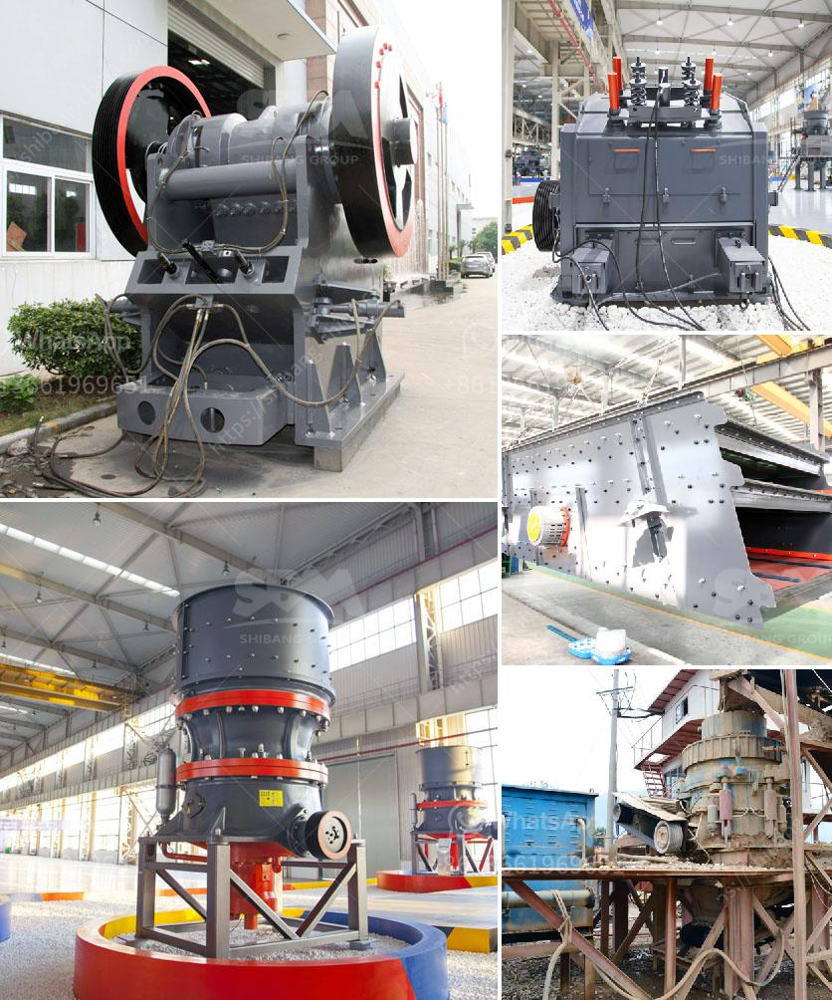

<h3>iron ore crusher machine</h3>
Iron ore crusher machine is a powerful machine that divides the iron ore, which exists unprocessed in nature, into small pieces to process after extraction. Iron ore crusher machine is utilised as a primary crusher, secondary crusher or tertiary crusher in crushing plants and has an important role in crushing the hardest stones and mines such as iron and basalt.

Iron ore crusher machine is a powerful machine that divides the iron ore, which exists unprocessed in nature, into small pieces to process after extraction refers to the process of uninstalling iron ore from its natural state.

Iron ore is the rock that is extracted from the mine and contains iron minerals in sufficiently high quantities to make it the easiest and cheapest source of iron for producing iron and steel, which are required in everyday life. Iron ores are rich in iron oxides and vary in color from dark grey, bright yellow, rusty red to deep purple. Crushing the raw ore into small pieces is an essential step in processing iron ore.

The working principle of iron ore crusher machine is that the material will be fed into the hopper through the vibrating feeder, and then the primary crushing is usually carried out by a jaw crusher or gyratory crusher, since these crushing equipment can handle large-sized raw materials.

The subsequent crushing process will be carried out by a cone crusher or an impact crusher, depending on the requirements of the final product. Cone crushers resemble gyratory crushers but operate with a steeper cone slope and a concave bowl liner. As the gap between the bowl liner and the mantle narrows, the rock is crushed between the mantle by the gyrating cone.

Impact crushers, on the other hand, use high-speed impact force to crush materials, resulting in better reduction ratios and lower wear costs. The feed material enters the machine's crushing chamber and hits the mounted impact lining plates on the rotor. The material is then propelled against the impact surfaces by the impact wall and is crushed through impact crushing.

Iron ore crusher machine is a powerful machine that divides the iron ore, which exists unprocessed in nature, into small pieces to process after extraction. This machine has a high potential to increase the operational efficiency of a mining operation.

One of the most significant advantages of iron ore crusher machine is that it allows iron ore to be processed anywhere. As long as the equipment is installed in a convenient location, it can be used in various industries. This makes the crushing process more flexible and creates more possibilities for iron ore processing.

Another advantage of iron ore crusher machine is its energy-saving capability. Thanks to its efficient motors, this machine consumes less power, allowing operators to save both money and energy. This is particularly important as the mining industry continues to prioritize environmentally friendly practices.

The working principle of iron ore crusher machine involves the material being fed into the hopper through the vibrating feeder, where primary crushing is usually carried out by a jaw crusher or gyratory crusher. The subsequent crushing process is carried out by a cone crusher or an impact crusher.

Iron ore crusher machine offers numerous advantages, including its ability to be installed anywhere and its energy-saving capability. These advantages make it a vital piece of equipment in the mining industry, contributing to increased operational efficiency and environmentally friendly practices.
<h3>Contact us</h3><ul><li><strong>Whatsapp:&nbsp;<a href="https://wa.me/8613661969651">+8613661969651</a></strong></li><li><a href="https://swt.shibang-china.com/?git&amp;zhl&amp;iron ore crusher machine"><strong>Online Service(chat now)</strong></a></li></ul><h3>Related</h3><ul><li><a href='vibrating sieve supplier in south africa.md'>vibrating sieve supplier in south africa</a></li><li><a href='jaw rock crusher price by owner.md'>jaw rock crusher price by owner</a></li><li><a href='small rock crushers for recreation.md'>small rock crushers for recreation</a></li><li><a href='companies of conveyor belts in mexico.md'>companies of conveyor belts in mexico</a></li><li><a href='products hpc cone crusher.md'>products hpc cone crusher</a></li></ul>