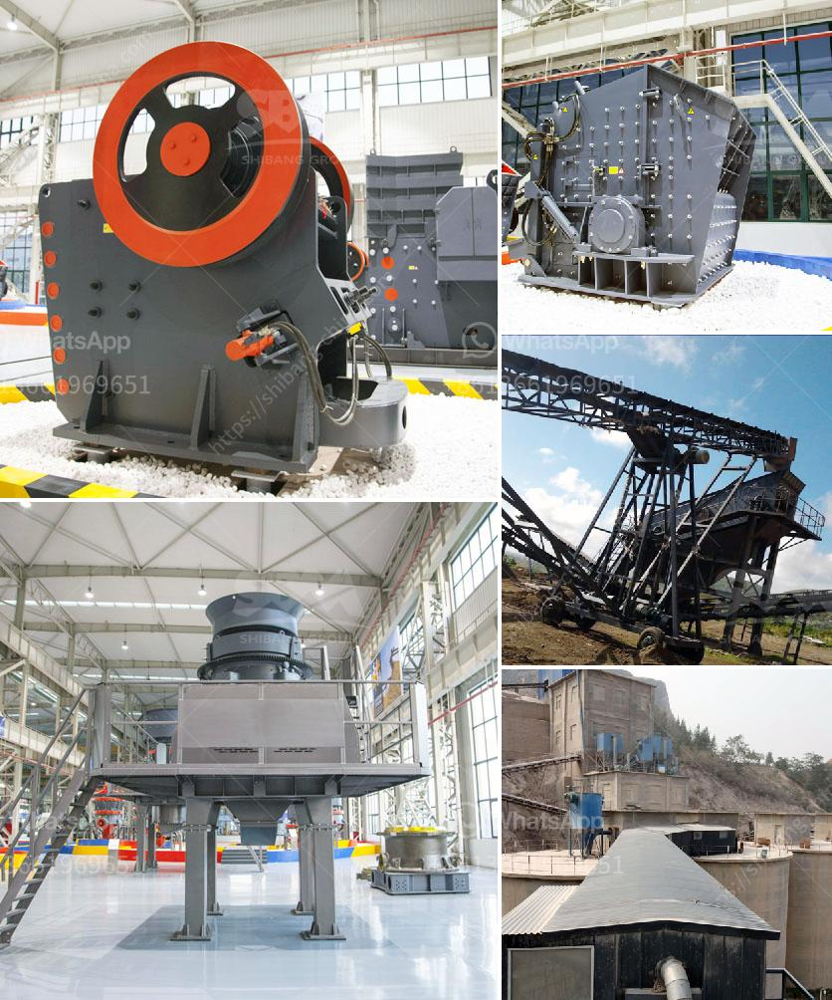

<h3>iron ore crusher units in orissa</h3>
Iron ore has been one of the most sought-after minerals globally. In Orissa, there are numerous iron ore crusher units that cater to the needs of various industrial sectors. These units produce huge volumes of iron ore to meet production demands and play a crucial role in India's overall iron ore supply chain.

Orissa, situated in eastern India, is rich in mineral resources, with iron ore being a significant contributor to the state's economy. The iron ores found in Orissa are of high quality and are widely used in various industries such as steel plants, sponge iron plants, cement plants, and thermal power plants.

The iron ore crusher units in Orissa are generally of two types, namely stationary and mobile. Stationary crushers are fixed at the extraction site and are used for large-scale production whereas the mobile units are transported to various sites for crushing the ore. These crusher units are equipped with heavy-duty crushers that efficiently break down the large-sized rocks into smaller sizes suitable for onward transportation and processing.

One of the major advantages of these crusher units is that they help in enhancing the overall efficiency of the iron ore production process. They ensure that the ore is finely crushed and prepared for further processing, which results in improved quality of the final product. Moreover, these units also contribute to reducing the wastage of valuable resources by ensuring maximum extraction of iron ore from the available reserves.

The iron ore crusher units in Orissa employ skilled workers who are trained in operating these heavy machines. They have a sound understanding of the crushing process and monitor the operations to ensure that the crushers are working at optimal capacity and producing the desired output.

However, the iron ore crusher units in Orissa have also faced numerous challenges over the years. One of the major issues is the availability of raw materials. As the demand for iron ore continues to increase, there is a constant pressure on these units to procure sufficient quantities of raw ore. This has led to intensifying competition among the units, resulting in heightened costs and logistical challenges.

Furthermore, environmental concerns have also posed challenges for these crusher units. As the extraction of iron ore involves breaking down large rocks, it generates a significant amount of dust and noise pollution. To mitigate these environmental impacts, the units are required to install pollution control measures such as dust suppression systems and noise reduction mechanisms. However, these additional requirements incur extra costs for the units, further adding to the operational expenses.

In conclusion, the iron ore crusher units in Orissa play a crucial role in meeting the iron ore demands of various industries. They help in efficient extraction and processing of iron ore, thereby contributing to India's overall iron ore supply chain. However, they also face challenges such as availability of raw materials and environmental concerns. With adequate support and investment, these units can continue to drive the growth of the iron ore industry in Orissa and contribute to the nation's economic development.
<h3>Contact us</h3><ul><li><strong>Whatsapp:&nbsp;<a href="https://wa.me/8613661969651">+8613661969651</a></strong></li><li><a href="https://swt.shibang-china.com/?git&amp;zhl&amp;iron ore crusher units in orissa"><strong>Online Service(chat now)</strong></a></li></ul><h3>Related</h3><ul><li><a href='wet and dry ball mill.md'>wet and dry ball mill</a></li><li><a href='europe conveyor belts manufacturer.md'>europe conveyor belts manufacturer</a></li><li><a href='mobile jaw crushers.md'>mobile jaw crushers</a></li><li><a href='stone crusher plant 80 ton.md'>stone crusher plant 80 ton</a></li><li><a href='small hammer mill grinder 10 mm.md'>small hammer mill grinder 10 mm</a></li></ul>