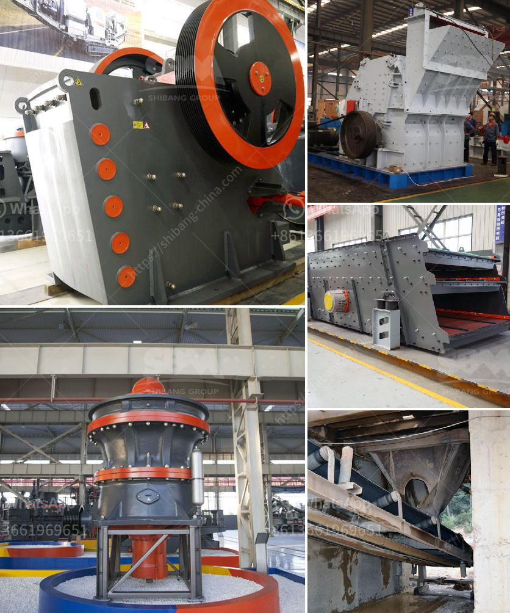

<h3>iron ore magnetic separation from titanium process</h3>
Iron ore is one of the most commonly mined minerals in the world, with millions of tons processed annually. The extraction of iron from its ore is a delicate process that requires meticulous attention to detail. Different minerals need to be separated through magnetic separation from titanium to ensure their suitability for various industries. This process plays a crucial role in maintaining the quality and purity of iron ore, making it suitable for the desired applications.

Magnetic separation is a technique that uses magnets to attract and separate magnetic substances from non-magnetic ones. In the context of iron ore beneficiation, magnetic separation is typically used to remove magnetic minerals such as magnetite, a highly magnetic mineral that imparts a dark color to iron ore. Titanium-bearing minerals, however, are often weakly magnetic and can be difficult to separate from other minerals.

The presence of titanium in iron ore can cause several issues during the steelmaking process. Titanium can react with carbon at high temperatures, forming titanium carbides, which are undesired in steel due to their negative impact on the mechanical properties of the final product. Furthermore, titanium can also react with oxygen and sulfur, resulting in the formation of undesirable compounds that need to be removed.

To remove titanium-bearing minerals from iron ore, various magnetic separation techniques are employed. The most common approach involves utilizing a magnetic field to attract the titanium-bearing minerals, which can then be separated from the non-magnetic minerals. The specific magnetic forces applied during this process depend on the nature and composition of the iron ore.

In many cases, multiple stages of magnetic separation are required to achieve efficient separation of titanium-bearing minerals from iron ore. This is because different minerals have different magnetic properties, and a single separation step may not be sufficient. For instance, after the initial magnetic separation to remove highly magnetic minerals like magnetite, a second stage of separation may be required to target weaker magnetic minerals such as ilmenite, which often contains significant amounts of titanium.

The effectiveness of magnetic separation in removing titanium-bearing minerals relies on the use of high-intensity magnetic fields. These fields are generated by electromagnets or permanent magnets, which produce a powerful magnetic gradient. As the iron ore passes through the magnetic field, the titanium-bearing minerals are attracted and separated from the bulk of the ore.

Magnetic separation is a complex process, and optimizing the efficiency of the separation is critical to ensuring the desired quality of the final iron ore product. Factors such as magnetic field intensity, feed particle size, and magnetic susceptibility of the minerals being separated all influence the effectiveness of magnetic separation.

In conclusion, magnetic separation is a vital process in the extraction of iron ore, allowing the removal of titanium-bearing minerals to ensure the desired quality of the final product. By employing magnetic separation techniques, iron ore producers can achieve increased efficiency and produce iron ore suitable for various industrial applications. Continued research and optimization of the magnetic separation process will further enhance the productivity and quality of iron ore extraction.
<h3>Contact us</h3><ul><li><strong>Whatsapp:&nbsp;<a href="https://wa.me/8613661969651">+8613661969651</a></strong></li><li><a href="https://swt.shibang-china.com/?git&amp;zhl&amp;iron ore magnetic separation from titanium process"><strong>Online Service(chat now)</strong></a></li></ul><h3>Related</h3><ul><li><a href='stone crushers machinery in south africa.md'>stone crushers machinery in south africa</a></li><li><a href='impact crusher machine.md'>impact crusher machine</a></li><li><a href='small diesel engine crusher from tanzania.md'>small diesel engine crusher from tanzania</a></li><li><a href='stone crusher in sri lanka.md'>stone crusher in sri lanka</a></li><li><a href='jaw crusher machine in south africa.md'>jaw crusher machine in south africa</a></li></ul>