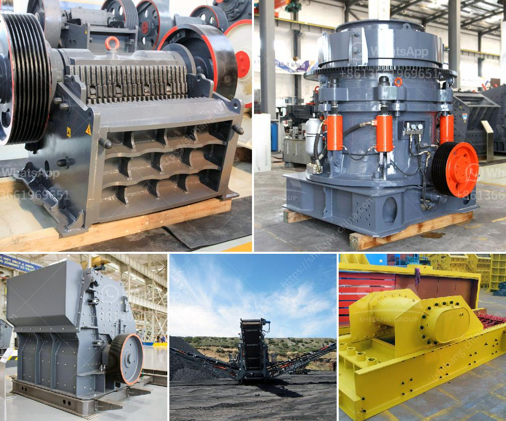

<h3>iron ore mining crushing process</h3>
Iron ore is an important raw material in steel production enterprises. After iron ore crusher's crushing , grinding, magnetic separation, flotation, re-election and other procedures, iron will be gradually separated from natural minerals (iron ore). Theoretically, mineral that contains iron element or iron compound is called iron ore. But, to industry or business, different from manganese ore, not only the iron ore contains iron element, but also it has use value. So iron ore mining is an important process for mining industry.

Iron ore is typically mined in huge volumes and only crushed and screened before it is exported. Nonetheless, certain deposits require physical processing of the ore to reach grades high enough to render transport economical. The beneficiation process includes crushing, screening, grinding, classification, and magnetic separation.

Crushing is the important and integral stage in iron processing operation. Iron ore crushing generally can be processed in three steps to produce different particle sizes: primary crushing, secondary crushing and tertiary crushing. Typically, primary crushing process for iron ores will be carried out in jaw crushers, while secondary crushing typically uses cone or impact crushers. Most large iron ore mines use many types of crushers, especially for tertiary and quaternary crushing. For fine crushing or regrinding, mechanical mills are used.

The researchers analyzed 28 samples of iron ore crushing plant in the northern Tata Iron Mine, India. They found that those samples share the same characteristics as the iron ores from the Bolani Hematite deposit, thus suggesting hematite as the major component of these ores. However, it was also found that the majority of finer particles are not liberated and remain mixed with gangue minerals.

Grinding is the subsequent step of the concentration process and it is a key processing unit operation. Iron ore grinding process is the process to grinding or pulverize iron ore particle into iron ore powder, which is used to make raw materials for iron making.

During the iron crushing and iron grinding process, there are many types of iron ore crusher, such as jaw crusher, cone crusher, impact crusher, hammer crusher and mobile crusher etc. The iron ore crushing process starts from the crushing equipment for iron ore and then iron ore is the raw material used to make pig iron, which is one of the main raw materials to make steel. The raw material is crushed to the required size and then sent to a silo for storage through a conveyor belt.

In conclusion, iron ore crushing process is mostly used for poor iron ore, which has weaker properties including magnetism, and proportionality and high oxidation rate. Iron ore crushing process includes crushing, grinding, gravity separation, magnetic separation, etc. Iron ore crushing process is the best method for material selection and mining process, common iron ores are magnetite, hematite, limonite and siderite, with good chemical properties and high iron content.

Overall, the iron ore mining crushing process is a complex process. It involves various processing stages, including crushing, grinding, classification, and magnetic separation. Iron ore resources are extremely rich in the world, but the majority of them belong to complex ultra-poor magnetite ore. Therefore, the requirements for iron ore beneficiation technologies should be complex as well to achieve the highest recovery rate. Nonetheless, the crushing process is an essential step in iron ore mining, as it creates the necessary particles for the concentration process to work efficiently.
<h3>Contact us</h3><ul><li><strong>Whatsapp:&nbsp;<a href="https://wa.me/8613661969651">+8613661969651</a></strong></li><li><a href="https://swt.shibang-china.com/?git&amp;zhl&amp;iron ore mining crushing process"><strong>Online Service(chat now)</strong></a></li></ul><h3>Related</h3><ul><li><a href='diagram of a hammer mill machine.md'>diagram of a hammer mill machine</a></li><li><a href='prices of conveyor belt.md'>prices of conveyor belt</a></li><li><a href='bentonite jaw crushers india.md'>bentonite jaw crushers india</a></li><li><a href='sandstone sand making machine manufacturer.md'>sandstone sand making machine manufacturer</a></li><li><a href='tertiary vertical shaft impact crusher.md'>tertiary vertical shaft impact crusher</a></li></ul>