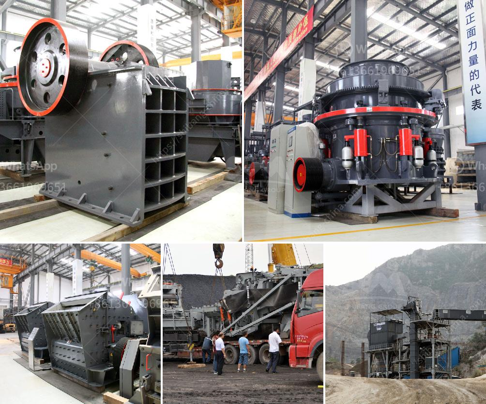

<h3>iron ore pellet making process</h3>
Iron ore pellet is a highly refined form of iron ore granules that are produced by heating iron ore particles in a type of furnace known as a pelletizer. These pellets are approximately 65% iron, which makes them ideal for use in blast furnaces and steel mills to enhance the overall efficiency of the steelmaking process.

The iron ore pellet making process consists of three main stages: raw material preparation, pellet formation, and pellet hardening. The details of each stage are outlined below.

During the raw material preparation stage, iron ore fines are ground into finer particles. The goal is to release iron mineral from gangue minerals so that it can be concentrated by various gravity separation methods. Once the ore is finely ground, it is then mixed with additives such as limestone, dolomite, or bentonite clay. These additives help bind the ore together and improve its ability to withstand high temperatures during the pelletizing process.

The pellet formation stage begins with the mixing of the processed ore with water to form a thick slurry. This slurry is then fed into a pelletizer, where it is rolled into small spherical balls called green pellets. The green pellets are then passed through a grate system that controls their size.

Next comes the pellet hardening stage, where the green pellets are subjected to high temperatures inside a furnace. The heat causes the pellets to solidify and become hardened. This process, known as induration, removes any remaining moisture in the pellets and chemically bonds them together, ensuring their strength and stability.

Once the pellets are hardened, they are cooled and screened to remove any undersized or oversized particles. The final product is a uniform, high-quality pellet that can be directly used in blast furnaces or steel mills.

The production of iron ore pellets offers numerous advantages over traditional iron ore extraction and processing methods. Pellets have a higher iron content and a more uniform chemical composition, resulting in improved productivity and lower energy consumption during steelmaking. Additionally, pellets have a better handling and transportation characteristic, allowing for efficient storage and transportation to steel mills.

In conclusion, the iron ore pellet making process is a highly refined form of iron ore granules that offers numerous benefits in terms of improved productivity and lower energy consumption. This process involves raw material preparation, pellet formation, and pellet hardening stages to produce high-quality pellets. With the increasing demand for steel worldwide, iron ore pellets play a crucial role in meeting the industry's requirements.
<h3>Contact us</h3><ul><li><strong>Whatsapp:&nbsp;<a href="https://wa.me/8613661969651">+8613661969651</a></strong></li><li><a href="https://swt.shibang-china.com/?git&amp;zhl&amp;iron ore pellet making process"><strong>Online Service(chat now)</strong></a></li></ul><h3>Related</h3><ul><li><a href='types of ball mill machine for gold.md'>types of ball mill machine for gold</a></li><li><a href='quarry crusher cost.md'>quarry crusher cost</a></li><li><a href='gyratory crusher hydroset.md'>gyratory crusher hydroset</a></li><li><a href='low cost jaw crusher for sale in ethiopia.md'>low cost jaw crusher for sale in ethiopia</a></li><li><a href='vibrating screen price.md'>vibrating screen price</a></li></ul>