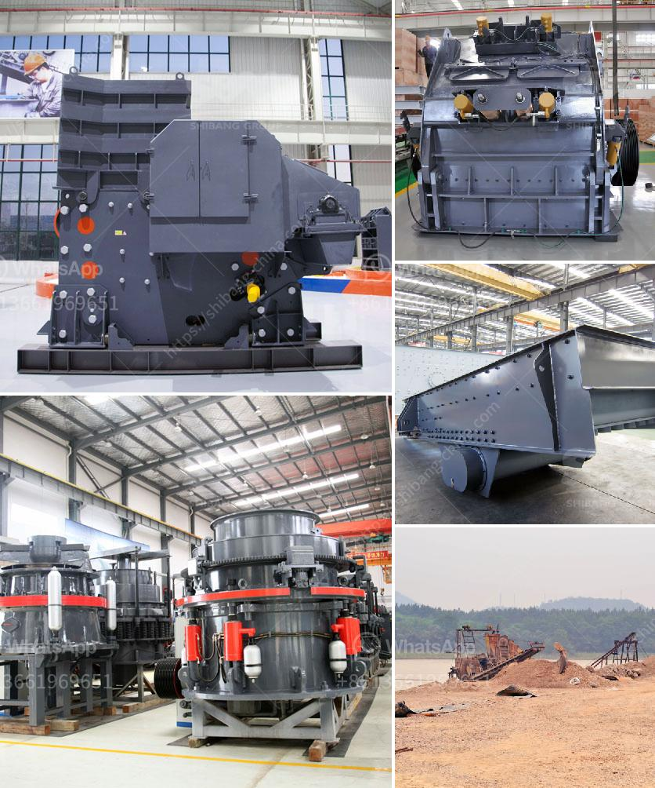

<h3>iron ore processing equipment cost</h3>
Iron ore is one of the main raw materials used in the production of steel. However, the extraction and processing of iron ore require a significant amount of machinery and equipment, resulting in high costs. One of the key factors that determine the cost of iron ore processing equipment is the type of equipment selected.

There are several different types of equipment that are commonly used in the processing of iron ore. These include crushers, magnetic separators, conveyors, and grinding mills. Each of these pieces of equipment comes with its own set of costs, which can vary depending on factors such as equipment size, capacity, and efficiency.

Crushers are used to break down the iron ore into smaller pieces that can be easily handled and processed. The cost of crushers can vary greatly depending on the type of crusher and its features. For example, a jaw crusher is usually more expensive than a gyratory crusher due to its larger size and higher capacity.

Magnetic separators are crucial in the iron ore beneficiation process as they help remove impurities and enhance the iron content. The cost of magnetic separators can vary depending on their size, strength, and efficiency. High-intensity magnetic separators are generally more expensive but offer better performance in terms of iron ore purification.

Conveyors are used to transport the iron ore from one processing stage to another. The cost of conveyors depends on factors such as conveyor length, width, and capacity. Additionally, the terrain and distance between different processing stages can also affect the overall cost of conveyor systems.

Grinding mills are used to further refine the iron ore particles and prepare them for the next stage of processing. The cost of grinding mills can vary depending on factors such as mill size, capacity, and power consumption. More efficient grinding mills tend to be more expensive but can help reduce overall processing costs in the long run.

Apart from the type of equipment, other factors that contribute to the cost of iron ore processing equipment include installation and maintenance expenses. The complexity of the equipment and the extent of automation also influence the overall cost. Additionally, ongoing operating costs, such as energy consumption and consumables, should be taken into account when considering the total cost of iron ore processing equipment.

In summary, the cost of iron ore processing equipment can range from high to low depending on factors such as equipment type, size, capacity, and efficiency. Crushers, magnetic separators, conveyors, and grinding mills are some of the key equipment used in the processing of iron ore. It is essential for mining companies to carefully evaluate the cost and benefits of different equipment options to optimize their iron ore processing operations.
<h3>Contact us</h3><ul><li><strong>Whatsapp:&nbsp;<a href="https://wa.me/8613661969651">+8613661969651</a></strong></li><li><a href="https://swt.shibang-china.com/?git&amp;zhl&amp;iron ore processing equipment cost"><strong>Online Service(chat now)</strong></a></li></ul><h3>Related</h3><ul><li><a href='coal mill in malaysia.md'>coal mill in malaysia</a></li><li><a href='basalt production process.md'>basalt production process</a></li><li><a href='limestone crushing processing for the manufacture.md'>limestone crushing processing for the manufacture</a></li><li><a href='buyers ball mill process.md'>buyers ball mill process</a></li><li><a href='micro fine grinding mill.md'>micro fine grinding mill</a></li></ul>