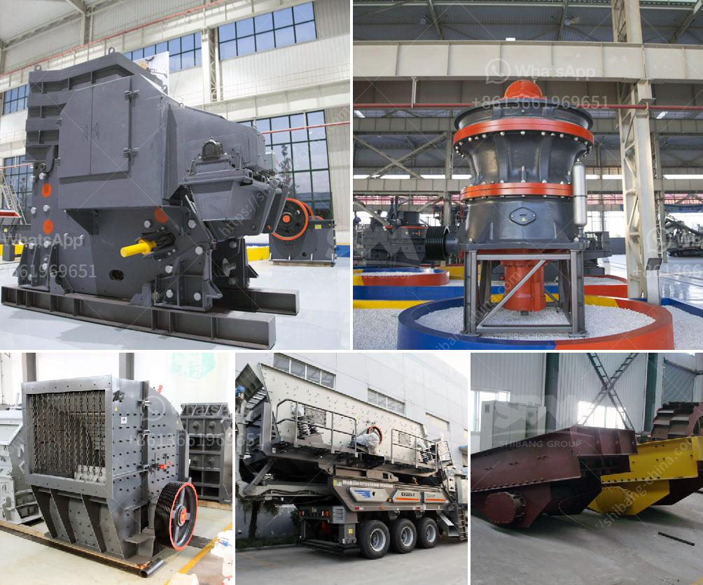

<h3>iron ore smelter equipment</h3>
Iron ore smelting is a crucial step in the production of steel. Without proper smelting equipment, iron ore can easily go to waste or become useless. Therefore, it is essential to have high-quality smelting equipment that can efficiently process iron ore and produce high-grade steel.

One of the most important pieces of equipment in iron ore smelting is the blast furnace. It is a large, vertical cylindrical structure that is capable of producing tremendous amounts of heat. The blast furnace utilizes a combination of iron ore, coke (a form of carbon), and limestone. These materials are loaded into the furnace from the top and gradually move downward.

As the materials descend, they are exposed to extreme temperatures, reaching up to 2000 degrees Celsius. The coke acts as the fuel source, providing the necessary heat to melt the iron ore. The limestone serves as a flux, removing impurities from the iron ore during the smelting process.

To facilitate the smelting process, blast furnaces are equipped with various other components. One such component is the tuyere, which is a nozzle-like structure that injects air into the furnace. The injected air serves two purposes – it provides oxygen to aid in the combustion of coke and it also helps to keep the temperature high.

Another important component is the hearth, which is the bottom portion of the blast furnace where the molten iron accumulates. The hearth is lined with refractory bricks capable of withstanding extreme temperatures. These bricks ensure that the molten iron does not come into contact with the structural components of the furnace, thus preventing damage to the furnace itself.

In addition to the blast furnace, iron ore smelting requires other equipment to ensure a smooth and efficient operation. Conveyors are often used to transport the iron ore from the mining site to the blast furnace. These conveyors are designed to handle large amounts of material and are built to withstand the rigorous demands of the iron smelting process.

Pollution control equipment is another crucial aspect of iron ore smelter equipment. The smelting process produces various harmful emissions, including carbon dioxide, sulfur dioxide, and particulate matter. To mitigate these environmental impacts, smelters are equipped with air pollution control devices, such as scrubbers and electrostatic precipitators. These devices help to reduce emissions and ensure compliance with environmental regulations.

Overall, the smelting of iron ore requires the use of specialized equipment to efficiently transform raw materials into high-grade steel. Blast furnaces, conveyors, pollution control equipment, and other components work in tandem to facilitate the smelting process. It is crucial for smelters to invest in high-quality equipment to maximize productivity, minimize waste, and meet environmental standards. By investing in the right equipment, iron ore smelters can ensure a consistent and reliable supply of steel for various industries.
<h3>Contact us</h3><ul><li><strong>Whatsapp:&nbsp;<a href="https://wa.me/8613661969651">+8613661969651</a></strong></li><li><a href="https://swt.shibang-china.com/?git&amp;zhl&amp;iron ore smelter equipment"><strong>Online Service(chat now)</strong></a></li></ul><h3>Related</h3><ul><li><a href='graphite ore beneficiation.md'>graphite ore beneficiation</a></li><li><a href='stone quarry machines for sale.md'>stone quarry machines for sale</a></li><li><a href='cone crusher instructions.md'>cone crusher instructions</a></li><li><a href='jaw crusher machine in south africa.md'>jaw crusher machine in south africa</a></li><li><a href='crusher machine discount.md'>crusher machine discount</a></li></ul>