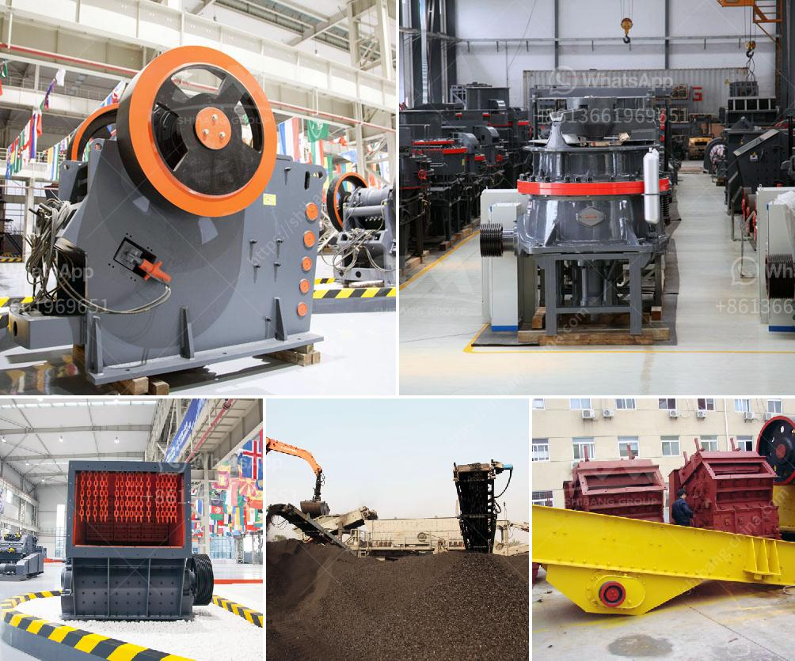

<h3>iron ore upgrading plant equipment</h3>
Iron ore is one of the most abundant resources in the world, making it a vital component for the construction and manufacturing industries. However, extracting and processing iron ore can be a complex and expensive endeavor. One crucial step in this process is iron ore upgrading plant equipment.

Iron ore upgrading plants are designed to process iron ore particles and separate impurities like silica, alumina, and phosphorous from the ore. This allows for more efficient downstream processing and the production of higher-grade iron ore concentrates.

One key piece of equipment used in iron ore upgrading plants is the spiral concentrator. Spiral concentrators are gravity separation devices that separate minerals based on their relative density. They utilize centrifugal force to separate heavy from light particles, effectively upgrading the iron ore.

Spiral concentrators consist of a helical trough with water flowing down the trough. The ore slurry is pumped into the top of the spiral concentrator and flows downwards. As it flows, the centrifugal force caused by the swirling motion of the water pushes the heavier iron ore particles towards the outer edge of the spiral. Lighter gangue particles are carried towards the center and eventually washed out of the system. The result is a separation of the iron ore concentrate from impurities.

Another important piece of equipment used in iron ore upgrading plants is the magnetic separator. Magnetic separators use magnetic forces to attract and separate magnetic materials from non-magnetic ones. In the case of iron ore upgrading, magnetic separators are used to separate magnetic iron ore particles from non-magnetic gangue.

The magnetic separator consists of a drum that rotates with a magnetic field generated by a series of permanent magnets. As the drum rotates, the magnetic field attracts the magnetic iron ore particles, separating them from the non-magnetic gangue. The magnetic concentrate is collected and further processed, while the non-magnetic gangue is discarded.

In addition to spiral concentrators and magnetic separators, other equipment used in iron ore upgrading plants include crushers, screens, and classifiers. Crushers are used to break down the ore into smaller particles, making it easier to separate the iron ore from impurities. Screens and classifiers are used to sort the crushed ore into different sizes.

Upgrading iron ore through plant equipment is essential for producing high-quality iron ore concentrates. The efficient removal of impurities not only improves the iron content of the product but also reduces the environmental impact of the mining and processing operations.

Investing in modern and efficient iron ore upgrading plant equipment can have numerous benefits for mining companies. Increased iron ore grades can lead to higher market prices and improved profitability. Additionally, upgrading plants can help mining operations comply with environmental regulations by reducing the quantity of waste material generated.

In conclusion, iron ore upgrading plant equipment plays a crucial role in the extraction and processing of iron ore. Spiral concentrators, magnetic separators, crushers, screens, and classifiers are just some of the equipment used to upgrade iron ore. Investing in efficient and modern equipment can lead to higher-quality iron ore concentrates and improved profitability for mining companies.
<h3>Contact us</h3><ul><li><strong>Whatsapp:&nbsp;<a href="https://wa.me/8613661969651">+8613661969651</a></strong></li><li><a href="https://swt.shibang-china.com/?git&amp;zhl&amp;iron ore upgrading plant equipment"><strong>Online Service(chat now)</strong></a></li></ul><h3>Related</h3><ul><li><a href='design and fabrication of ball mill pdf.md'>design and fabrication of ball mill pdf</a></li><li><a href='sand sieve machine.md'>sand sieve machine</a></li><li><a href='dolamite powder machine.md'>dolamite powder machine</a></li><li><a href='cost of copper ore processing plant.md'>cost of copper ore processing plant</a></li><li><a href='impact crusher machine.md'>impact crusher machine</a></li></ul>