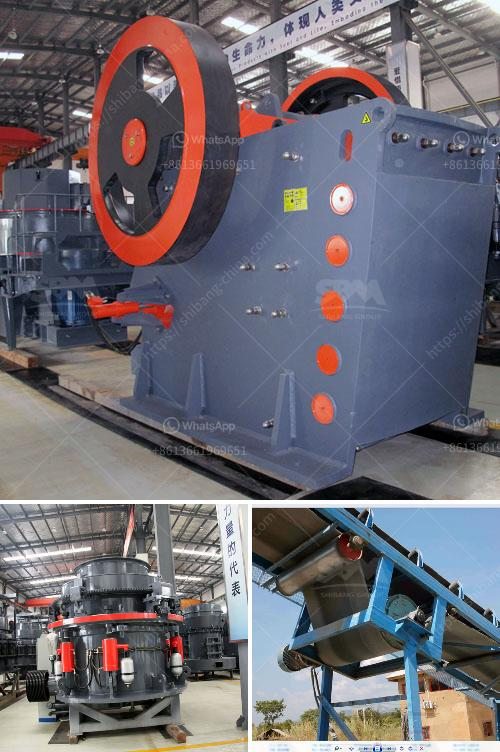

<h3>iron processing equipment</h3>
Iron processing equipment is essential for turning iron ore into usable metal products. The mining and processing of iron ore involve a series of complex steps that require advanced equipment. These include crushing and grinding, magnetic separation, pelletization, and sintering.

Crushing and grinding are the first steps in the process of iron ore extraction. The extracted iron ore is then crushed into small pieces and ground to a fine powder. This helps facilitate the subsequent separation of the iron particles from the gangue minerals, which are unwanted impurities.

Magnetic separation is another important process in iron ore beneficiation. As the name suggests, it involves using magnetic forces to remove magnetite particles from the ore. Magnetite is strongly magnetic, so it can be easily separated from the surrounding rock material using a magnetic separator. This separation process can help increase the iron content of the ore and reduce the amount of wastage.

After magnetic separation, the iron ore is further processed into pellets or sinter. Pellets are small, spherical balls that are made from a mixture of iron ore concentrate, fluxes, and binders. The purpose of pelletizing is to increase the iron content of the ore and produce a uniform product that can be easily transported and used in blast furnaces.

On the other hand, sinter is a form of agglomerated iron ore that is created by heating the ore fines along with fluxes, fuel, and other supplementary materials. The sintering process helps improve the physical properties of the ore, making it suitable for use in blast furnaces. It involves a series of heating and cooling steps to create a cohesive mass of iron ore particles.

To carry out these processes efficiently, specialized iron processing equipment is required. Crushers and grinding mills are used for crushing and grinding the ore into smaller particles. Magnetic separators are used to separate magnetite particles from the rest of the ore. Pelletizing and sintering equipment then transform these particles into pellets or sinter.

Various types of equipment are used throughout the iron processing industry. Some common examples include jaw crushers, cone crushers, vibrating screens, and ball mills for crushing and grinding; magnetic separators, high-intensity magnetic separators, and eddy current separators for magnetic separation; rotary kilns, traveling grates, and grate-kiln systems for pelletizing; and sintering machines, strand coolers, and cyclones for sintering.

In recent years, there have been advancements in iron processing equipment to improve efficiency and reduce environmental impacts. For example, energy-saving ball mills, high-gradient magnetic separators, and advanced sintering machines have been developed. These advancements have helped enhance the productivity and reduce the energy consumption of iron processing operations.

In conclusion, iron processing equipment plays a crucial role in the mining and processing of iron ore. It helps extract valuable metal products from the ore and transform them into usable materials. With advancements in technology, iron processing equipment continues to evolve, enabling more efficient and sustainable operations in the industry.
<h3>Contact us</h3><ul><li><strong>Whatsapp:&nbsp;<a href="https://wa.me/8613661969651">+8613661969651</a></strong></li><li><a href="https://swt.shibang-china.com/?git&amp;zhl&amp;iron processing equipment"><strong>Online Service(chat now)</strong></a></li></ul><h3>Related</h3><ul><li><a href='portable crusher plant crusher plant price.md'>portable crusher plant crusher plant price</a></li><li><a href='coal screening machine suppliers.md'>coal screening machine suppliers</a></li><li><a href='ball mill hammer mill roller mill machine.md'>ball mill hammer mill roller mill machine</a></li><li><a href='bauxite screening machine.md'>bauxite screening machine</a></li><li><a href='coal screening chrushing machines.md'>coal screening chrushing machines</a></li></ul>